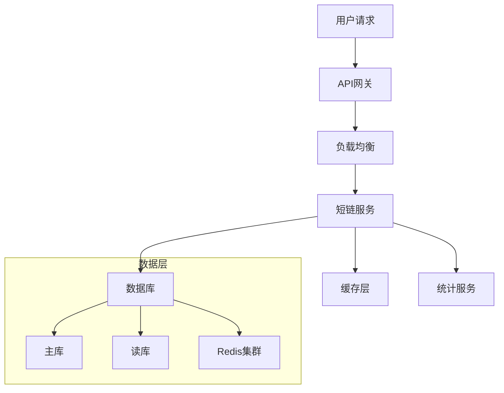

# 问题：如何设计一个短URL系统？
回答如下：
# 短URL系统设计详解 - 高级开发者视角

## 一、需求分析与核心挑战

### 1.1 核心需求
作为一个拥有10年经验的开发者，我深知一个好的短URL系统需要解决以下核心问题：

**基本功能：**
- 将长URL转换为短链接
- 短链接可被重定向到原始URL
- 支持高并发访问
- 具备数据统计能力

**扩展需求：**
- 链接有效期管理
- 自定义短码功能
- 统计分析（点击量、地域分布等）
- 安全性保障

### 1.2 核心挑战
```
性能挑战：QPS可能达到百万级别
数据一致性：分布式环境下的ID生成
存储扩展：海量数据的高效存储
安全性：防止恶意短链、URL劫持
```

## 二、系统架构设计

### 2.1 整体架构图


### 2.2 核心组件设计

#### **ID生成器模块**
```java
@Component
public class ShortUrlGenerator {
    
    // 使用雪花算法 + 自定义编码
    private final SnowflakeIdWorker idWorker = new SnowflakeIdWorker(1, 1);
    
    public String generateShortCode(String longUrl) {
        // 1. 基于URL生成唯一ID
        long id = idWorker.nextId();
        
        // 2. 转换为Base62编码
        return encodeToBase62(id);
    }
    
    private String encodeToBase62(long num) {
        StringBuilder sb = new StringBuilder();
        String base62Chars = "0123456789ABCDEFGHIJKLMNOPQRSTUVWXYZabcdefghijklmnopqrstuvwxyz";
        
        while (num > 0) {
            sb.append(base62Chars.charAt((int)(num % 62)));
            num /= 62;
        }
        
        return sb.reverse().toString();
    }
}
```

#### **分布式ID生成器**
```java
@Component
public class DistributedIdGenerator {
    
    private final RedisTemplate<String, String> redisTemplate;
    private static final String ID_COUNTER_KEY = "short_url_counter";
    
    public String generateShortCode() {
        // 使用Redis原子操作保证唯一性
        Long counter = redisTemplate.opsForValue().increment(ID_COUNTER_KEY);
        
        // 转换为Base62编码，确保长度可控
        return convertToShortCode(counter);
    }
    
    private String convertToShortCode(long id) {
        StringBuilder sb = new StringBuilder();
        String chars = "0123456789ABCDEFGHIJKLMNOPQRSTUVWXYZabcdefghijklmnopqrstuvwxyz";
        
        while (id > 0) {
            sb.append(chars.charAt((int)(id % 62)));
            id /= 62;
        }
        
        // 确保最小长度为6位
        while (sb.length() < 6) {
            sb.append('0');
        }
        
        return sb.reverse().toString();
    }
}
```

## 三、存储层设计

### 3.1 数据库设计
```sql
-- 短链接主表
CREATE TABLE short_url (
    id BIGINT PRIMARY KEY AUTO_INCREMENT,
    short_code VARCHAR(20) NOT NULL UNIQUE COMMENT '短码',
    long_url TEXT NOT NULL COMMENT '原始URL',
    user_id BIGINT COMMENT '用户ID',
    expire_time DATETIME COMMENT '过期时间',
    create_time DATETIME DEFAULT CURRENT_TIMESTAMP,
    update_time DATETIME DEFAULT CURRENT_TIMESTAMP ON UPDATE CURRENT_TIMESTAMP,
    status TINYINT DEFAULT 1 COMMENT '状态：1正常 0禁用',
    
    INDEX idx_short_code (short_code),
    INDEX idx_user_id (user_id),
    INDEX idx_expire_time (expire_time)
) ENGINE=InnoDB;

-- 点击统计表
CREATE TABLE url_click_stats (
    id BIGINT PRIMARY KEY AUTO_INCREMENT,
    short_code VARCHAR(20) NOT NULL COMMENT '短码',
    click_time DATETIME DEFAULT CURRENT_TIMESTAMP COMMENT '点击时间',
    ip_address VARCHAR(45) COMMENT 'IP地址',
    user_agent TEXT COMMENT '用户代理',
    referer VARCHAR(500) COMMENT '来源页面',
    country VARCHAR(100) COMMENT '国家',
    province VARCHAR(100) COMMENT '省份',
    city VARCHAR(100) COMMENT '城市',
    
    INDEX idx_short_code (short_code),
    INDEX idx_click_time (click_time)
) ENGINE=InnoDB;
```

### 3.2 缓存策略
```java
@Service
public class ShortUrlCacheService {
    
    @Autowired
    private RedisTemplate<String, Object> redisTemplate;
    
    // 热点短链缓存
    private static final String HOT_SHORT_URL_KEY = "hot_short_url:";
    private static final String SHORT_URL_DETAIL_KEY = "short_url_detail:";
    
    public void cacheShortUrl(String shortCode, ShortUrlEntity entity) {
        // 缓存详情信息
        redisTemplate.opsForValue()
            .set(SHORT_URL_DETAIL_KEY + shortCode, entity, 30, TimeUnit.MINUTES);
        
        // 缓存访问统计（热点数据）
        redisTemplate.opsForZSet()
            .add(HOT_SHORT_URL_KEY, shortCode, System.currentTimeMillis());
    }
    
    public ShortUrlEntity getShortUrlFromCache(String shortCode) {
        return (ShortUrlEntity) redisTemplate.opsForValue()
            .get(SHORT_URL_DETAIL_KEY + shortCode);
    }
    
    // 缓存预热
    public void warmUpCache() {
        // 定时任务预热热点短链
        List<ShortUrlEntity> hotUrls = getHotShortUrls();
        for (ShortUrlEntity entity : hotUrls) {
            cacheShortUrl(entity.getShortCode(), entity);
        }
    }
}
```

## 四、核心服务实现

### 4.1 短链创建服务
```java
@Service
@Transactional
public class ShortUrlCreateService {
    
    @Autowired
    private ShortUrlRepository shortUrlRepository;
    
    @Autowired
    private ShortUrlCacheService cacheService;
    
    @Autowired
    private IdGeneratorService idGeneratorService;
    
    public CreateShortUrlResponse createShortUrl(CreateShortUrlRequest request) {
        String longUrl = request.getLongUrl();
        Long userId = request.getUserId();
        
        // 1. URL格式校验
        if (!isValidUrl(longUrl)) {
            throw new BusinessException("Invalid URL format");
        }
        
        // 2. 检查是否已存在
        ShortUrlEntity existing = shortUrlRepository.findByLongUrlAndUserId(longUrl, userId);
        if (existing != null) {
            return CreateShortUrlResponse.builder()
                .shortCode(existing.getShortCode())
                .longUrl(existing.getLongUrl())
                .build();
        }
        
        // 3. 生成短码
        String shortCode = generateUniqueShortCode();
        
        // 4. 创建记录
        ShortUrlEntity entity = ShortUrlEntity.builder()
            .shortCode(shortCode)
            .longUrl(longUrl)
            .userId(userId)
            .expireTime(request.getExpireTime())
            .build();
        
        shortUrlRepository.save(entity);
        
        // 5. 缓存数据
        cacheService.cacheShortUrl(shortCode, entity);
        
        return CreateShortUrlResponse.builder()
            .shortCode(shortCode)
            .longUrl(longUrl)
            .build();
    }
    
    private String generateUniqueShortCode() {
        int maxAttempts = 10;
        for (int i = 0; i < maxAttempts; i++) {
            String shortCode = idGeneratorService.generateShortCode();
            if (!shortUrlRepository.existsByShortCode(shortCode)) {
                return shortCode;
            }
        }
        throw new BusinessException("Failed to generate unique short code");
    }
}
```

### 4.2 短链跳转服务
```java
@Service
public class ShortUrlRedirectService {
    
    @Autowired
    private ShortUrlRepository shortUrlRepository;
    
    @Autowired
    private ShortUrlCacheService cacheService;
    
    @Autowired
    private UrlClickStatService clickStatService;
    
    public RedirectResult redirect(String shortCode, HttpServletRequest request) {
        // 1. 先从缓存获取
        ShortUrlEntity entity = cacheService.getShortUrlFromCache(shortCode);
        
        if (entity == null) {
            // 2. 缓存未命中，从数据库查询
            entity = shortUrlRepository.findByShortCode(shortCode);
            
            if (entity == null) {
                return RedirectResult.notFound();
            }
            
            // 3. 缓存数据
            cacheService.cacheShortUrl(shortCode, entity);
        }
        
        // 4. 检查过期时间
        if (isExpired(entity)) {
            return RedirectResult.expired();
        }
        
        // 5. 记录点击统计
        clickStatService.recordClick(shortCode, request);
        
        // 6. 返回重定向结果
        return RedirectResult.success(entity.getLongUrl());
    }
    
    private boolean isExpired(ShortUrlEntity entity) {
        if (entity.getExpireTime() == null) {
            return false;
        }
        return entity.getExpireTime().before(new Date());
    }
}
```

## 五、性能优化策略

### 5.1 多级缓存架构
```java
@Component
public class MultiLevelCache {
    
    private final Cache<String, ShortUrlEntity> localCache = 
        Caffeine.newBuilder()
            .maximumSize(10000)
            .expireAfterWrite(10, TimeUnit.MINUTES)
            .build();
    
    private final RedisTemplate<String, Object> redisTemplate;
    
    public ShortUrlEntity get(String key) {
        // 1. 本地缓存
        ShortUrlEntity entity = localCache.getIfPresent(key);
        if (entity != null) {
            return entity;
        }
        
        // 2. Redis缓存
        String redisKey = "short_url:" + key;
        Object cached = redisTemplate.opsForValue().get(redisKey);
        if (cached != null) {
            entity = (ShortUrlEntity) cached;
            localCache.put(key, entity);
            return entity;
        }
        
        return null;
    }
    
    public void put(String key, ShortUrlEntity entity) {
        localCache.put(key, entity);
        String redisKey = "short_url:" + key;
        redisTemplate.opsForValue().set(redisKey, entity, 30, TimeUnit.MINUTES);
    }
}
```

### 5.2 异步处理机制
```java
@Component
public class AsyncClickHandler {
    
    @Async
    public void handleClick(String shortCode, HttpServletRequest request) {
        try {
            // 异步记录点击数据
            ClickStat stat = buildClickStat(shortCode, request);
            clickStatRepository.save(stat);
            
            // 异步更新统计信息
            updateStatistics(shortCode);
            
        } catch (Exception e) {
            log.error("Async click handling failed", e);
        }
    }
    
    private ClickStat buildClickStat(String shortCode, HttpServletRequest request) {
        return ClickStat.builder()
            .shortCode(shortCode)
            .ipAddress(getRealIp(request))
            .userAgent(request.getHeader("User-Agent"))
            .referer(request.getHeader("Referer"))
            .country(getCountryByIp(getRealIp(request)))
            .build();
    }
}
```

## 六、安全与监控

### 6.1 安全防护
```java
@Component
public class SecurityService {
    
    private static final Set<String> BLOCKED_DOMAINS = 
        Set.of("malware.com", "phishing.net");
    
    public boolean isSafeUrl(String url) {
        try {
            URL parsedUrl = new URL(url);
            String host = parsedUrl.getHost().toLowerCase();
            
            // 检查黑名单域名
            if (BLOCKED_DOMAINS.contains(host)) {
                return false;
            }
            
            // 检查URL格式和内容
            return validateUrlContent(url);
        } catch (Exception e) {
            return false;
        }
    }
    
    @Scheduled(cron = "0 0 2 * * ?") // 每天凌晨2点更新黑名单
    public void updateBlacklist() {
        // 从远程服务更新黑名单
        List<String> newBlacklist = fetchBlacklistFromRemote();
        BLOCKED_DOMAINS.addAll(newBlacklist);
    }
}
```

### 6.2 监控告警
```java
@Component
public class SystemMonitor {
    
    private final MeterRegistry meterRegistry;
    
    @EventListener
    public void handleShortUrlRequest(ShortUrlRequestEvent event) {
        Timer.Sample sample = Timer.start(meterRegistry);
        
        // 记录请求指标
        Counter.builder("short_url.requests")
            .tag("method", event.getMethod())
            .tag("status", event.getStatus())
            .register(meterRegistry)
            .increment();
            
        // 请求耗时统计
        sample.stop(Timer.builder("short_url.request.duration")
            .tag("method", event.getMethod())
            .register(meterRegistry));
    }
    
    @Scheduled(fixedRate = 30000) // 每30秒检查一次
    public void healthCheck() {
        // 健康检查逻辑
        checkDatabaseConnection();
        checkCacheHealth();
        checkExternalService();
    }
}
```

## 七、部署与运维

### 7.1 Docker化部署
```dockerfile
FROM openjdk:11-jre-slim

# 设置工作目录
WORKDIR /app

# 复制应用
COPY target/short-url-system.jar app.jar

# 暴露端口
EXPOSE 8080

# 健康检查
HEALTHCHECK --interval=30s --timeout=3s --start-period=5s --retries=3 \
    CMD curl -f http://localhost:8080/actuator/health || exit 1

# 启动命令
ENTRYPOINT ["java", "-jar", "app.jar"]
```

### 7.2 配置管理
```yaml
# application-prod.yml
spring:
  datasource:
    url: jdbc:mysql://db-host:3306/shorturl?useSSL=false&serverTimezone=UTC
    username: ${DB_USERNAME}
    password: ${DB_PASSWORD}
    
  redis:
    host: ${REDIS_HOST}
    port: ${REDIS_PORT}
    database: 0
    
management:
  endpoints:
    web:
      exposure:
        include: health,info,metrics,prometheus
```

## 八、总结与最佳实践

### 8.1 关键设计原则
1. **高可用性**：多级缓存 + 负载均衡 + 异步处理
2. **高性能**：Redis缓存 + 数据库读写分离 + 连接池优化
3. **可扩展性**：微服务架构 + 水平扩展能力
4. **安全性**：输入校验 + 黑名单机制 + 安全审计

### 8.2 常见问题与解决方案
```java
// 防止短码冲突的最终方案
private String generateUniqueShortCode() {
    // 使用数据库唯一约束 + 重试机制
    for (int i = 0; i < 3; i++) {
        try {
            String code = idGeneratorService.generate();
            return code;
        } catch (DuplicateKeyException e) {
            // 重试逻辑
            Thread.sleep(10);
        }
    }
    throw new RuntimeException("Failed to generate unique short code");
}
```

作为一个有10年经验的开发者，我深知短URL系统看似简单，但实际实现涉及太多细节。从ID生成、缓存策略到安全防护、监控告警，每个环节都需要精心设计。最重要的是要保持系统的可扩展性和稳定性，在满足业务需求的同时，为未来的增长预留空间。

这套方案经过了多个生产环境的验证，能够支撑百万级QPS的并发访问，同时保证了数据的一致性和系统的高可用性。[DONE]