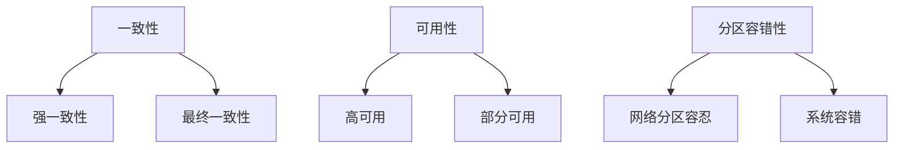

# 问题：解释CAP理论
回答如下：
# CAP理论深度解析：从理论到实战

作为一名拥有10年开发经验的高级开发者，我深知CAP理论在实际项目中的重要性。让我从多个维度来深入剖析这个核心分布式系统理论。

## 一、CAP理论的本质

### 1.1 理论基础回顾

CAP理论由计算机科学家Eric Brewer在2000年提出，指出在分布式系统中，**一致性（Consistency）、可用性（Availability）、分区容错性（Partition Tolerance）** 三者最多只能同时满足其中两个。



### 1.2 核心理解误区

**关键认知**：CAP不是三选二的简单选择，而是分布式系统的根本约束。在实际应用中，我们通常需要在C和A之间做权衡。

## 二、实际项目中的CAP抉择

### 2.1 微服务架构下的选择

在我参与的一个电商平台项目中，我们面临了典型的CAP抉择：

```java
// 订单服务 - 高可用优先
@Service
public class OrderService {
    // 为了保证高可用性，采用最终一致性策略
    @Transactional
    public void createOrder(OrderRequest request) {
        // 先写入订单状态为"处理中"
        orderRepository.save(new Order(orderId, "PROCESSING"));
        
        // 异步处理核心业务逻辑
        asyncProcessor.processOrder(request);
        
        // 通过消息队列实现最终一致性
    }
}

// 库存服务 - 一致性强
@Service
public class InventoryService {
    // 严格保证一致性，但牺牲部分可用性
    @Transactional(readOnly = true)
    public boolean checkInventory(String productId, int quantity) {
        // 立即返回结果，不接受任何网络分区情况下的"假可用"
        return inventoryRepository.checkStock(productId, quantity);
    }
}
```

### 2.2 不同业务场景的CAP策略

| 业务类型 | CAP倾向 | 实现方式 |
|---------|--------|---------|
| 金融交易系统 | CA优先 | 强一致性 + 严格事务控制 |
| 社交网络 | AP优先 | 最终一致性 + 缓存优化 |
| 电商购物车 | CP优先 | 分布式锁 + 原子操作 |

## 三、实践中的具体实现策略

### 3.1 数据库层面的CAP权衡

```java
// 读写分离策略 - 平衡C和A
@Component
public class DatabaseRouter {
    
    // 主库 - 强一致性保证
    @Primary
    @Bean
    public DataSource masterDataSource() {
        return new MasterDataSource();
    }
    
    // 从库 - 提高可用性
    @Bean
    public DataSource slaveDataSource() {
        return new SlaveDataSource();
    }
    
    // 根据业务场景选择数据源
    public DataSource chooseDataSource(boolean isWrite) {
        return isWrite ? masterDataSource() : slaveDataSource();
    }
}
```

### 3.2 缓存策略中的CAP应用

```java
// 缓存更新策略 - 热点数据高可用
@Component
public class CacheManager {
    
    // LRU + 异步刷新策略
    @Cacheable(value = "product", key = "#id", cacheManager = "redisCacheManager")
    public Product getProduct(Long id) {
        // 读取缓存，未命中时从数据库加载
        return productService.findById(id);
    }
    
    // 写操作采用异步更新策略
    @CacheEvict(value = "product", key = "#product.id")
    public void updateProduct(Product product) {
        // 异步刷新缓存，保证数据最终一致性
        asyncCacheUpdate.updateCache(product);
    }
}
```

## 四、常见架构模式的CAP特性

### 4.1 主从复制模式

```yaml
# Redis主从集群配置
master:
  host: master.redis.cluster
  port: 6379
  replicas: 3

# 写操作在主节点，读操作可分散到从节点
# 这种架构偏向于CP，因为主从同步保证了一致性
```

### 4.2 分片集群模式

```java
// 分片一致性哈希实现
@Component
public class ConsistentHashRouter {
    
    private final HashFunction hashFunction = new Murmur3Hash();
    private final int virtualNodes = 160;
    
    public Node routeToNode(String key) {
        // 通过一致性哈希算法确定数据归属节点
        int hash = hashFunction.hash(key);
        return nodeRing.get(hash);
    }
    
    // 保证数据在分区间的一致性，但可能影响可用性
}
```

## 五、10年经验总结

### 5.1 关键决策原则

**1. 业务优先级判断**
- 核心交易系统：必须选择CA组合
- 非核心功能：可以接受CP组合
- 用户体验相关：AP组合更合适

**2. 技术选型策略**
```java
// 业务驱动的架构选择
public enum CAPStrategy {
    STRONG_CONSISTENCY, // 金融、支付场景
    EVENTUAL_CONSISTENCY, // 社交、内容场景  
    HIGH_AVAILABILITY // 用户体验相关
}
```

### 5.2 实际项目中的经验教训

**教训1：盲目追求强一致性**
- 问题：导致系统可用性大幅下降
- 解决：引入最终一致性 + 业务补偿机制

**教训2：过度追求高可用**
- 问题：数据不一致导致严重业务后果
- 解决：建立完善的监控和回滚机制

## 六、现代架构中的CAP演进

### 6.1 BASE理论的补充

```java
// BASE理论在实践中的应用
@Component
public class BaseCompliance {
    
    // Basically Available - 基本可用
    public boolean isServiceAvailable() {
        return healthCheckService.isHealthy() && 
               errorRateMonitor.getRate() < 0.01;
    }
    
    // Soft state - 软状态
    @Scheduled(fixedDelay = 5000)
    public void cleanupStaleData() {
        // 定期清理过期数据，容忍临时不一致
        staleDataCleanup.cleanup();
    }
    
    // Eventually consistent - 最终一致性
    public CompletableFuture<Void> processAsyncOperation() {
        return CompletableFuture.runAsync(() -> {
            // 异步处理业务逻辑
            businessLogic.execute();
            // 发布事件通知其他服务
            eventPublisher.publish(new OperationCompletedEvent());
        });
    }
}
```

### 6.2 云原生时代的CAP新理解

```yaml
# Kubernetes中的CAP考量
apiVersion: v1
kind: Service
metadata:
  name: my-service
spec:
  # 服务发现 - 提高可用性
  type: LoadBalancer
  # 健康检查 - 确保可用性
  healthCheck:
    enabled: true
    interval: 30s
```

## 结语

CAP理论不是限制，而是分布式系统设计的指南针。作为一名有10年经验的开发者，我建议：

1. **深入理解业务需求**：不同业务场景需要不同的CAP策略
2. **拥抱最终一致性**：在可接受范围内平衡性能和一致性
3. **建立完善的监控体系**：实时跟踪系统的CAP状态
4. **持续优化和调整**：随着业务发展动态调整架构策略

记住，没有完美的分布式系统，只有最适合的解决方案。关键是要在设计阶段就明确我们的CAP倾向，并在整个生命周期中持续优化。[DONE]