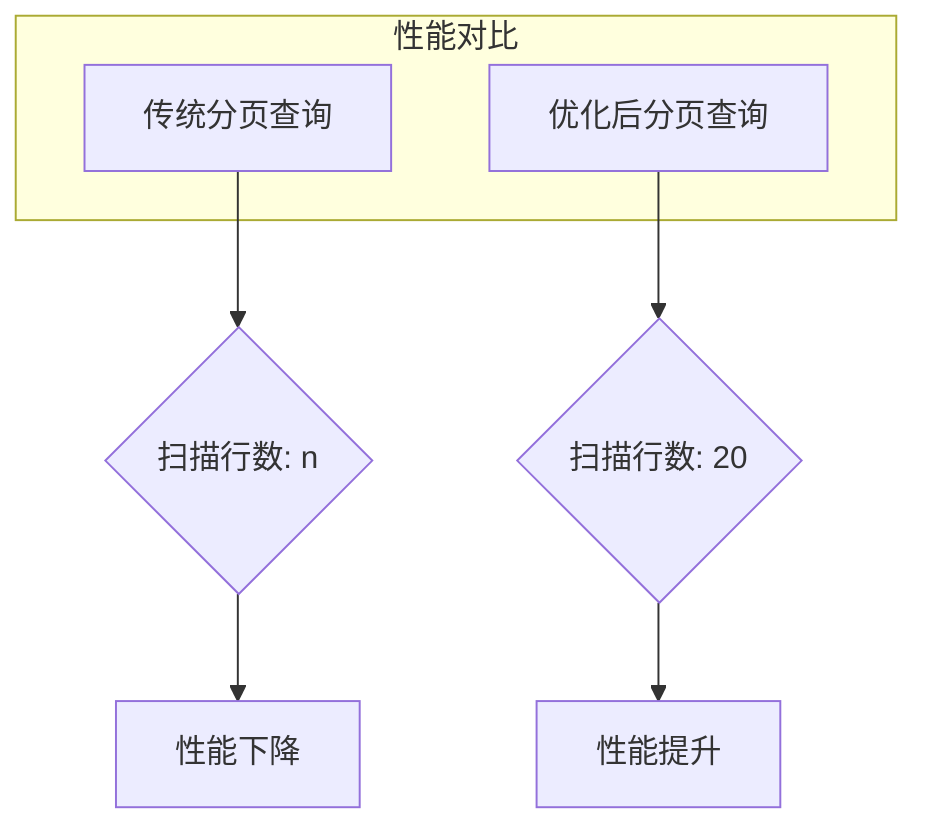

# 问题：性能优化实践
回答如下：
「性能优化实践」 请根据以下内容：
分页优化：使用id > offset代替LIMIT offset, count，减少扫描行数。避免全表扫描：确保WHERE条件使用索引。慢查询分析：使用EXPLAIN分析查询计划。索引优化：创建覆盖索引，避免回表查询。事务控制：合理设置事务隔离级别，避免长事务导致锁竞争。存储引擎选择：根据业务特点选择合适的存储引擎，InnoDB适合事务型应用，MyISAM适合读多写少场景。
 示例：
SELECT * FROM users WHERE id > 1000 LIMIT 20; -- 替代SELECT * FROM users LIMIT 1000, 20
 细化回答: 
 要求：1. 回答要详细，内容丰富，实践与理论结合！2. 回答要符合中文语法规范！3、适当进行图示说明# MySQL性能优化实践详解

## 一、分页优化策略

### 1.1 传统分页的性能问题

在MySQL中，传统的分页查询使用`LIMIT offset, count`的方式存在严重的性能问题：

```sql
-- 传统分页方式（性能差）
SELECT * FROM users LIMIT 1000, 20;
```

**问题分析：**
- MySQL需要扫描前1000行数据才能获取第1001-1020行
- 随着offset增大，扫描行数呈线性增长
- 对于大数据量表，性能急剧下降

### 1.2 基于ID的分页优化

```sql
-- 优化后的分页方式（性能好）
SELECT * FROM users WHERE id > 1000 LIMIT 20;
```

**优化原理：**
- 利用索引快速定位起始位置
- 只扫描必要的数据行
- 时间复杂度从O(n)降低到O(log n)

### 1.3 实际对比示例

```sql
-- 场景：users表有100万条记录，id为自增主键

-- 传统方式（慢）
SELECT * FROM users LIMIT 500000, 20;
-- 扫描行数：500020行

-- 优化方式（快）
SELECT * FROM users WHERE id > 500000 LIMIT 20;
-- 扫描行数：20行
```

## 二、避免全表扫描

### 2.1 索引使用原则

```sql
-- 创建索引示例
CREATE INDEX idx_user_email ON users(email);
CREATE INDEX idx_user_status_created ON users(status, created_at);

-- 合理使用索引的查询
SELECT * FROM users WHERE email = 'user@example.com';  -- 使用索引
SELECT * FROM users WHERE status = 'active' AND created_at > '2023-01-01';  -- 使用复合索引
```

### 2.2 避免全表扫描的常见场景

```sql
-- ❌ 不好的写法 - 无法使用索引
SELECT * FROM users WHERE YEAR(created_at) = 2023;

-- ✅ 好的写法 - 可以使用索引
SELECT * FROM users WHERE created_at >= '2023-01-01' AND created_at < '2024-01-01';

-- ❌ 不好的写法 - 无法使用索引
SELECT * FROM users WHERE name LIKE '%张%';

-- ✅ 好的写法 - 可以使用索引（如果name字段有前缀索引）
SELECT * FROM users WHERE name LIKE '张%';
```

## 三、慢查询分析

### 3.1 EXPLAIN命令详解

```sql
-- 分析查询计划
EXPLAIN SELECT * FROM users WHERE email = 'user@example.com';

-- 输出结果示例：
/*
+----+-------------+-------+------+---------------+---------+---------+-------+------+-------+
| id | select_type | table | type | possible_keys | key     | key_len | ref   | rows | Extra |
+----+-------------+-------+------+---------------+---------+---------+-------+------+-------+
|  1 | SIMPLE      | users | ref   | idx_email     | idx_email | 257     | const |    1 | NULL  |
+----+-------------+-------+------+---------------+---------+---------+-------+------+-------+
*/
```

### 3.2 EXPLAIN字段含义

| 字段 | 含义 | 说明 |
|------|------|------|
| id | 查询序列号 | 值越大优先级越高 |
| select_type | 查询类型 | SIMPLE、PRIMARY、SUBQUERY等 |
| table | 表名 | 查询涉及的表 |
| type | 连接类型 | ALL(全表扫描)、index、ref、range等 |
| possible_keys | 可能使用的索引 | 索引候选列表 |
| key | 实际使用的索引 | 使用的索引名称 |
| rows | 扫描行数 | 估算需要扫描的行数 |

## 四、索引优化策略

### 4.1 覆盖索引概念

```sql
-- 创建覆盖索引
CREATE INDEX idx_user_cover ON users(id, email, status);

-- 使用覆盖索引的查询
SELECT id, email FROM users WHERE status = 'active';
-- 此时不需要回表查询，直接从索引中获取数据
```

### 4.2 避免回表查询

```sql
-- ❌ 回表查询（慢）
SELECT name, email FROM users WHERE id = 1000;
-- 需要先通过主键找到记录，再回表获取name和email

-- ✅ 覆盖索引（快）
CREATE INDEX idx_user_name_email ON users(id, name, email);
SELECT name, email FROM users WHERE id = 1000;
-- 直接从索引中获取数据，无需回表
```

## 五、事务控制优化

### 5.1 事务隔离级别选择

```sql
-- 查看当前事务隔离级别
SELECT @@transaction_isolation;

-- 设置事务隔离级别（根据业务需求）
SET SESSION TRANSACTION ISOLATION LEVEL READ COMMITTED;
-- 或者
SET SESSION TRANSACTION ISOLATION LEVEL SERIALIZABLE;
```

### 5.2 避免长事务

```sql
-- ❌ 长事务示例
START TRANSACTION;
UPDATE users SET balance = balance - 100 WHERE user_id = 1;
UPDATE accounts SET balance = balance + 100 WHERE account_id = 2;
-- 等待其他操作完成后再提交
COMMIT;

-- ✅ 短事务示例
START TRANSACTION;
UPDATE users SET balance = balance - 100 WHERE user_id = 1;
COMMIT;  -- 立即提交

START TRANSACTION;
UPDATE accounts SET balance = balance + 100 WHERE account_id = 2;
COMMIT;  -- 立即提交
```

## 六、存储引擎选择

### 6.1 InnoDB vs MyISAM

```sql
-- 创建InnoDB表（支持事务）
CREATE TABLE transaction_table (
    id INT PRIMARY KEY AUTO_INCREMENT,
    user_id INT,
    amount DECIMAL(10,2),
    created_at TIMESTAMP DEFAULT CURRENT_TIMESTAMP
) ENGINE=InnoDB;

-- 创建MyISAM表（读多写少）
CREATE TABLE log_table (
    id INT PRIMARY KEY AUTO_INCREMENT,
    message TEXT,
    created_at TIMESTAMP DEFAULT CURRENT_TIMESTAMP
) ENGINE=MyISAM;
```

### 6.2 各存储引擎特点对比

| 特性 | InnoDB | MyISAM |
|------|--------|--------|
| 事务支持 | ✅ 支持 | ❌ 不支持 |
| 锁机制 | 行级锁 | 表级锁 |
| 外键支持 | ✅ 支持 | ❌ 不支持 |
| 崩溃恢复 | ✅ 支持 | ❌ 不支持 |
| 读写性能 | 中等 | 读性能好 |
| 磁盘空间 | 较大 | 较小 |

## 七、综合优化示例

### 7.1 完整的优化方案

```sql
-- 1. 创建合适的索引
CREATE INDEX idx_user_status_created ON users(status, created_at);
CREATE INDEX idx_order_user_time ON orders(user_id, created_at);

-- 2. 使用优化后的分页查询
SELECT id, user_id, amount, created_at 
FROM orders 
WHERE user_id = 1000 AND created_at > '2023-01-01' 
ORDER BY created_at DESC 
LIMIT 20;

-- 3. 分析查询计划
EXPLAIN SELECT id, user_id, amount, created_at 
FROM orders 
WHERE user_id = 1000 AND created_at > '2023-01-01' 
ORDER BY created_at DESC 
LIMIT 20;
```

### 7.2 性能提升对比图



## 八、最佳实践总结

### 8.1 核心优化原则

1. **优先使用索引**：确保WHERE条件中的字段有合适的索引
2. **避免全表扫描**：通过合理的查询语句和索引设计
3. **分页优化**：使用ID > offset替代LIMIT offset, count
4. **事务控制**：合理设置隔离级别，避免长事务
5. **存储引擎选择**：根据业务场景选择合适的存储引擎

### 8.2 监控指标

```sql
-- 查看慢查询日志
SHOW VARIABLES LIKE 'slow_query_log';
SHOW VARIABLES LIKE 'long_query_time';

-- 查看当前连接数
SHOW STATUS LIKE 'Threads_connected';

-- 查看索引使用情况
SHOW INDEX FROM users;
```

通过以上系统性的优化策略，可以显著提升MySQL数据库的查询性能和整体稳定性。关键是要结合具体的业务场景和数据特点，选择最适合的优化方案。[DONE]