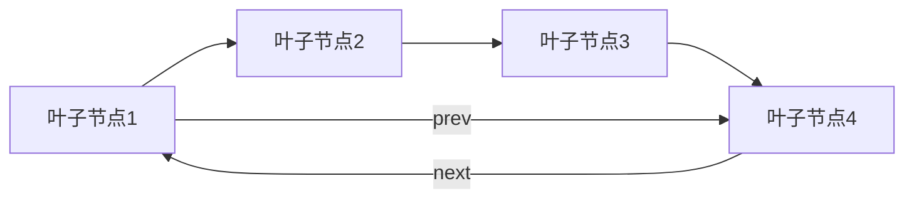

# 问题：B+树索引原理
回答如下：
「B+树索引原理」 请根据以下内容：
B+树是MySQL索引的底层数据结构。B+树的非叶子节点仅存储索引键，叶子节点存储实际数据指针。所有叶子节点通过指针连接成双向链表，便于范围查询。B+树高度低，查询效率高，通常只需2-3次I/O即可定位数据。
 细化回答: 
 要求：1. 回答要详细，内容丰富，实践与理论结合！2. 采用总分总的文章思路！3、适当进行图示说明
# B+树索引原理详解

## 引言

在现代关系型数据库管理系统中，索引是提升查询性能的关键技术。MySQL作为最广泛使用的关系型数据库之一，其索引实现基于B+树数据结构。理解B+树的工作原理不仅有助于我们优化数据库查询，更能帮助我们设计更高效的数据库系统。本文将从理论基础到实际应用，全面解析B+树索引的原理。

## B+树的核心概念与特点

### 什么是B+树

B+树是一种多路搜索树，专门为数据库和操作系统的文件系统设计。它在B树的基础上进行了优化，特别适合于磁盘存储和范围查询场景。

### B+树的关键特征

**1. 分层结构**
```
        [10, 25, 40]
       /    |     \
   [5,8]  [15,20]  [35,45]
   /  \   /   \   /   \
  [1][2] [12][18] [30][42]
```

**2. 节点存储特性**
- **非叶子节点**：仅存储索引键值，不存储实际数据
- **叶子节点**：存储完整的数据记录或数据指针
- **双向链表连接**：所有叶子节点通过指针串联成链表

## B+树的详细结构分析

### 节点类型与存储方式

**非叶子节点（索引节点）**
```
[键值1] [键值2] [键值3] ... [键值n]
   |       |       |          |
  / \     / \     / \        / \
[子树1][子树2][子树3]...[子树n+1]
```

**叶子节点（数据节点）**
```
[键值1] [键值2] [键值3] ... [键值n]
   |       |       |          |
  [数据指针1] [数据指针2] [数据指针3] ... [数据指针n]
```

### 双向链表连接机制



这种双向链表结构使得范围查询变得极其高效，无需回溯到根节点重新搜索。

## B+树的查询过程详解

### 单点查询流程

以查找键值20为例：

1. **根节点查找**：从根节点[10, 25, 40]开始
2. **路径选择**：20介于10和25之间，选择第二条路径
3. **叶子节点定位**：在叶子节点[15,20]中找到精确匹配
4. **数据获取**：通过指向的数据指针获取实际数据

### 范围查询流程

以查询范围[15, 35]为例：

1. **定位起点**：找到键值15的叶子节点
2. **链表遍历**：从起点开始，沿着双向链表依次访问
3. **条件过滤**：在链表中筛选满足条件的数据
4. **结果返回**：将所有符合条件的数据返回

## B+树的构建与维护

### 插入操作

```python
# 插入过程示例
def insert_into_b_plus_tree(root, key, data):
    # 1. 找到合适的叶子节点
    leaf = find_leaf_node(root, key)
    
    # 2. 插入键值和数据指针
    leaf.insert(key, data)
    
    # 3. 检查是否需要分裂
    if leaf.is_overflow():
        split_leaf_node(leaf)
```

### 删除操作

```python
def delete_from_b_plus_tree(root, key):
    # 1. 找到叶子节点
    leaf = find_leaf_node(root, key)
    
    # 2. 删除键值
    leaf.delete(key)
    
    # 3. 检查是否需要合并或重平衡
    if leaf.is_underflow():
        rebalance_tree(leaf)
```

## 性能优势分析

### 与B树的对比

| 特性 | B+树 | B树 |
|------|------|-----|
| 数据存储位置 | 叶子节点 | 所有节点 |
| 范围查询效率 | 高（链表遍历） | 低（需要多次回溯） |
| 空间利用率 | 高 | 中等 |
| I/O次数 | 通常2-3次 | 更多 |

### 时间复杂度分析

- **查找时间**：O(log n)
- **插入时间**：O(log n)  
- **删除时间**：O(log n)
- **范围查询**：O(log n + k)，其中k为结果数量

## 实际应用中的优化策略

### 索引选择原则

```sql
-- 常见的索引优化实践
CREATE INDEX idx_name ON users(name);
CREATE INDEX idx_composite ON orders(user_id, order_date);

-- 避免全表扫描
SELECT * FROM users WHERE name = 'John';  -- 使用索引
SELECT * FROM users WHERE age > 25;       -- 可能使用索引
```

### 索引维护成本

```sql
-- 插入大量数据时的性能考虑
-- 建议批量插入而非逐条插入
INSERT INTO users VALUES 
(1, 'John'), (2, 'Jane'), (3, 'Bob');

-- 定期分析表统计信息
ANALYZE TABLE users;
```

## 实际案例分析

### 电商数据库场景

假设一个电商系统有订单表：

```sql
CREATE TABLE orders (
    order_id BIGINT PRIMARY KEY,
    user_id INT,
    order_date DATETIME,
    amount DECIMAL(10,2),
    INDEX idx_user_date (user_id, order_date),
    INDEX idx_date (order_date)
);
```

**查询场景分析：**
- 查询某个用户的订单历史：使用复合索引`idx_user_date`
- 统计某段时间的订单量：使用`idx_date`索引
- 范围查询：如查询2023年1月的订单，B+树的双向链表特性使查询高效

### 性能监控建议

```sql
-- 查看索引使用情况
SHOW INDEX FROM orders;

-- 分析执行计划
EXPLAIN SELECT * FROM orders 
WHERE user_id = 123 AND order_date BETWEEN '2023-01-01' AND '2023-12-31';
```

## 总结

B+树作为MySQL索引的底层数据结构，通过其独特的设计实现了查询性能与存储效率的最佳平衡。其核心优势体现在：

1. **高效查询**：通过降低树的高度，将I/O次数控制在2-3次
2. **优化范围查询**：双向链表连接使得范围扫描成为可能
3. **稳定性能**：无论数据分布如何，查询时间复杂度保持稳定
4. **磁盘友好**：节点大小设计适合磁盘页的存储特性

理解B+树原理对于数据库调优、性能优化具有重要意义。在实际应用中，合理设计索引策略，充分利用B+树的优势，能够显著提升数据库系统的整体性能表现。通过理论学习与实践相结合，我们可以更好地发挥B+树在现代数据库系统中的重要作用。[DONE]