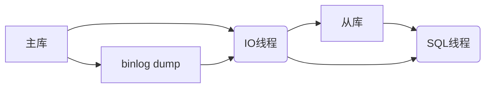
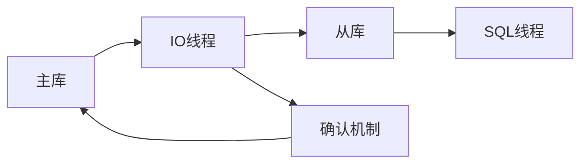
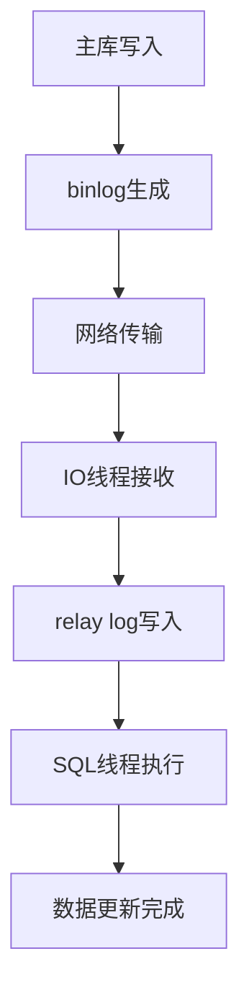

# 问题：MySQL复制原理
回答如下：
「MySQL复制原理」 请根据以下内容：
MySQL主从复制基于binlog实现。主库将数据变更记录到binlog，从库IO线程读取binlog，SQL线程执行binlog中的命令。复制方式包括异步复制、半同步复制和组复制。复制延迟是常见问题，可通过优化网络、调整参数解决。
 细化回答: 
 要求：1. 回答要详细，内容丰富，实践与理论结合！2. 采用总分总的文章思路！3、适当进行图示说明# MySQL主从复制原理详解

## 总述

MySQL主从复制是数据库高可用性架构中的核心技术之一，它通过将主库的数据变更实时同步到一个或多个从库，实现数据的冗余备份和读写分离。这种复制机制不仅提高了系统的可靠性，还能够分担主库的读压力，提升整体性能。本文将深入探讨MySQL主从复制的工作原理、实现机制以及常见问题的解决方案。

## 分述

### 一、核心工作原理

MySQL主从复制基于二进制日志（binlog）实现，这是一个关键的技术基础。让我们详细分析这个过程：

#### 1. binlog的作用机制
```
主库操作流程：
[用户请求] → [事务处理] → [写入binlog] → [写入redo log] → [提交事务]
```

- **binlog内容**：记录了所有更改数据的SQL语句（包括INSERT、UPDATE、DELETE等）
- **日志格式**：支持STATEMENT、ROW、MIXED三种格式
- **写入时机**：在事务提交前写入，确保数据一致性

#### 2. 复制过程详解


**具体执行流程**：
1. 主库执行事务时，将变更记录到binlog
2. 从库的IO线程通过连接主库获取binlog内容
3. IO线程将获取的binlog事件写入从库的中继日志（relay log）
4. SQL线程读取relay log中的事件并执行

### 二、三种复制方式对比

#### 1. 异步复制（Async Replication）
```
主库操作 → binlog → IO线程获取 → relay log → SQL线程执行
     ↑
   无等待确认
```

**特点**：
- 性能最好，延迟最低
- 主库不等待从库确认
- 可能出现数据丢失风险

**适用场景**：对数据一致性要求不高的环境

#### 2. 半同步复制（Semi-sync Replication）


**特点**：
- 主库等待至少一个从库确认接收binlog
- 提高数据安全性
- 性能略有下降

**配置要点**：
```sql
-- 主库配置
INSTALL PLUGIN rpl_semi_sync_master SONAME 'semisync_master.so';
SET GLOBAL rpl_semi_sync_master_enabled = 1;

-- 从库配置
INSTALL PLUGIN rpl_semi_sync_slave SONAME 'semisync_slave.so';
SET GLOBAL rpl_semi_sync_slave_enabled = 1;
```

#### 3. 组复制（Group Replication）
```
主库集群 → 组复制协议 → 多节点同步 → 一致性保证
```

**特点**：
- 基于Paxos协议的强一致性
- 自动故障检测和恢复
- 支持多主模式

### 三、复制延迟问题分析与解决

#### 1. 延迟产生的原因


**主要延迟因素**：
- 网络延迟和带宽限制
- SQL线程执行效率
- 从库硬件性能
- 主库并发压力

#### 2. 优化方案实践

**网络层面优化**：
```bash
# 使用高速网络连接
# 调整TCP参数
echo 'net.core.rmem_max = 134217728' >> /etc/sysctl.conf
echo 'net.core.wmem_max = 134217728' >> /etc/sysctl.conf
sysctl -p

# 优化binlog传输
SET GLOBAL binlog_cache_size = 1048576;
```

**参数调优**：
```sql
-- 从库相关参数优化
SET GLOBAL slave_net_timeout = 3600;
SET GLOBAL slave_parallel_threads = 4;
SET GLOBAL slave_parallel_type = 'LOGICAL_CLOCK';
SET GLOBAL innodb_flush_log_at_trx_commit = 2;

-- 主库相关参数
SET GLOBAL sync_binlog = 1;
SET GLOBAL binlog_format = 'ROW';
```

**硬件和架构优化**：
```bash
# 监控复制延迟
mysqladmin -u root -p -h slave_host processlist

# 查看复制状态
SHOW SLAVE STATUS\G

# 延迟监控脚本示例
#!/bin/bash
delay=$(mysql -e "SHOW SLAVE STATUS\G" | grep Seconds_Behind_Master | awk '{print $2}')
echo "Replication delay: ${delay} seconds"
```

### 四、实际部署建议

#### 1. 网络配置优化
```bash
# 配置主从库网络连接
[mysqld]
server-id = 100
log-bin = mysql-bin
binlog-format = ROW
binlog-row-image = FULL
```

#### 2. 监控和维护
```sql
-- 定期检查复制状态
SELECT 
    Slave_IO_Running,
    Slave_SQL_Running,
    Seconds_Behind_Master,
    Last_Error
FROM information_schema.slave_status;

-- 延迟预警设置
DELIMITER //
CREATE PROCEDURE check_replication_delay()
BEGIN
    DECLARE delay_time INT;
    SELECT Seconds_Behind_Master INTO delay_time 
    FROM information_schema.slave_status;
    
    IF delay_time > 300 THEN
        -- 发送告警邮件或日志记录
        INSERT INTO replication_log VALUES (NOW(), 'High replication delay detected');
    END IF;
END //
DELIMITER ;
```

## 总结

MySQL主从复制作为数据库高可用架构的核心技术，其原理清晰而实用。通过binlog机制实现数据的实时同步，配合异步、半同步和组复制三种模式，能够满足不同场景下的需求。

在实际应用中，需要根据业务特点选择合适的复制模式，并通过合理的参数调优、网络优化和监控维护来确保复制系统的稳定运行。同时，要时刻关注复制延迟问题，建立完善的监控预警机制，这样才能真正发挥主从复制在提升系统可靠性和性能方面的价值。

复制技术的发展趋势是向更高的一致性、更强的容错能力演进，未来的MySQL复制架构将更加智能化和自动化，为业务提供更强大的数据保障。[DONE]