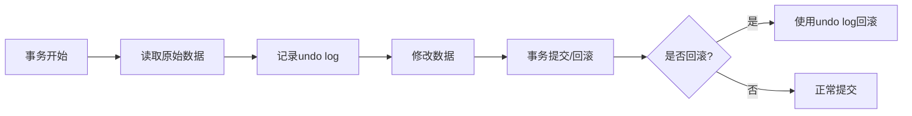
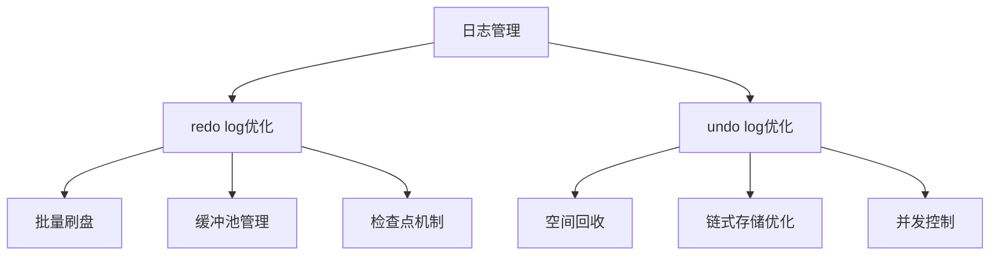

# 问题：redo log与undo log
回答如下：
「redo log与undo log」 请根据以下内容：
redo log（重做日志）用于保证事务的持久性，记录数据修改前后的值，实现崩溃恢复。undo log（回滚日志）用于事务回滚和MVCC，记录数据修改前的旧值。redo log是顺序写，性能高；undo log用于恢复和一致性读。
 细化回答: 
 要求：1. 回答要详细，内容丰富，实践与理论结合！2. 采用总分总的文章思路！3、适当进行图示说明# redo log与undo log详解：数据库事务的双重保障机制

## 总述

在现代关系型数据库系统中，事务的ACID特性是保证数据一致性和可靠性的核心。其中，持久性（Durability）和一致性（Consistency）的实现离不开两种重要的日志机制——redo log（重做日志）和undo log（回滚日志）。这两种日志虽然都服务于事务处理，但各自承担着不同的职责：redo log专注于保障事务的持久性，确保即使在系统崩溃的情况下也能恢复数据到一致状态；而undo log则主要负责事务回滚和多版本并发控制（MVCC），为数据库提供了一种安全的数据恢复和并发控制机制。

## 分述

### 一、Redo Log（重做日志）详解

#### 1.1 基本概念与作用
Redo log是数据库系统中最重要的持久性保障机制。它记录了数据页的物理修改操作，确保在系统崩溃后能够通过重做这些操作来恢复数据到一致状态。简单来说，redo log就是"我做了什么"的记录。

#### 1.2 工作原理


#### 1.3 实现机制
- **顺序写入**：redo log采用循环写入的方式，按照物理顺序存储，避免随机I/O的性能损耗
- **缓冲池管理**：在内存中维护redo log buffer，定期刷盘到磁盘
- **检查点机制**：定期将脏页刷盘，减少崩溃恢复时间

#### 1.4 实际应用场景
```sql
-- 示例：事务执行过程中的redo log记录
BEGIN;
UPDATE users SET balance = balance - 100 WHERE id = 1;
UPDATE users SET balance = balance + 100 WHERE id = 2;
COMMIT;
```
在这个过程中，redo log会记录：
- 修改前后的数据页内容
- 操作类型（更新、插入、删除）
- 事务ID和日志序列号

### 二、Undo Log（回滚日志）详解

#### 2.1 基本概念与作用
Undo log记录了数据修改前的旧值，主要用于事务回滚和MVCC机制。它是数据库实现原子性和一致性的重要工具。

#### 2.2 工作原理


#### 2.3 MVCC实现机制
Undo log通过以下方式支持MVCC：
- **多版本数据**：为每个修改操作保存旧版本数据
- **读视图机制**：不同事务看到不同的数据快照
- **一致性读**：保证事务内读取到的数据是一致的

#### 2.4 实际应用场景
```sql
-- 示例：MVCC场景下的undo log使用
BEGIN;
SELECT * FROM users WHERE id = 1; -- 读取当前版本
UPDATE users SET name = 'new_name' WHERE id = 1; -- 修改并记录undo
SELECT * FROM users WHERE id = 1; -- 事务内再次读取，仍为旧值
COMMIT;
```

### 三、两者对比分析

#### 3.1 功能对比表
| 特性 | Redo Log | Undo Log |
|------|----------|----------|
| **主要目的** | 保证持久性，崩溃恢复 | 事务回滚，MVCC支持 |
| **记录内容** | 修改前后的物理数据页 | 修改前的旧值 |
| **写入方式** | 顺序写入 | 链式存储 |
| **生命周期** | 持久化到数据页刷盘后 | 事务提交后可删除 |
| **性能特点** | 高性能，顺序I/O | 支持并发读取 |

#### 3.2 性能优化策略


## 总结

Redo log和undo log作为数据库系统中不可或缺的两个日志机制，共同构建了事务处理的完整保障体系。Redo log通过记录数据修改的"物理操作"确保了事务的持久性，即使在系统崩溃的情况下也能恢复到一致状态；而undo log则通过记录数据修改前的"旧值"实现了事务回滚和MVCC功能，保证了数据库的一致性和并发控制。

两者配合使用，形成了一个完整的事务处理闭环：
1. **事务执行阶段**：同时生成redo log和undo log
2. **提交阶段**：redo log确保持久性，undo log保留回滚信息
3. **恢复阶段**：通过redo log恢复数据，通过undo log回滚未提交事务

这种双重保障机制不仅保证了数据库的高可用性和可靠性，也为现代数据库系统提供了强大的并发控制和数据一致性保障。在实际应用中，合理配置这两种日志的参数，优化其性能表现，对于提升数据库整体性能具有重要意义。

通过深入理解redolog和undolog的工作原理，数据库开发人员和运维人员能够更好地进行性能调优、故障排查和系统设计，为构建稳定可靠的数据库应用奠定坚实基础。[DONE]