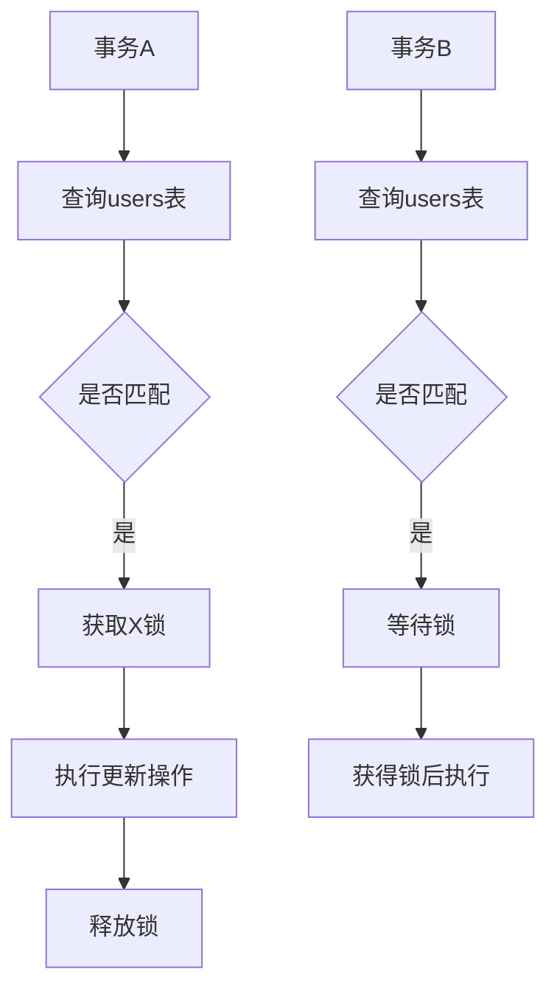
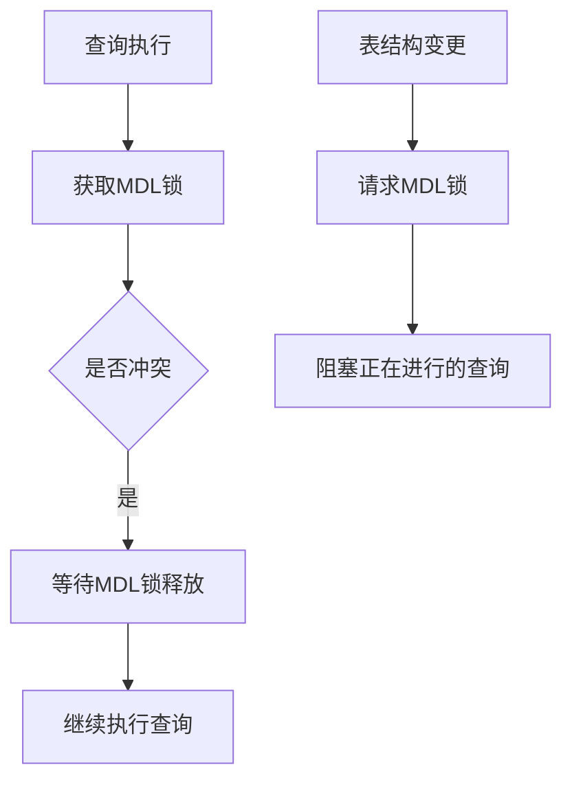

# 问题：锁机制：行级锁与表级锁
回答如下：
「锁机制：行级锁与表级锁」 请根据以下内容：
InnoDB支持行级锁，减少锁冲突，提高并发性能。行级锁包括共享锁（S锁）和排他锁（X锁）。表级锁包括表锁（LOCK TABLES）和元数据锁（MDL）。锁竞争是性能瓶颈的主要原因，合理设计索引和事务可以减少锁等待。
 细化回答: 
 要求：1. 回答要详细，内容丰富，实践与理论结合！2. 采用总分总的文章思路！3、适当进行图示说明# 锁机制：行级锁与表级锁详解

## 总述

在数据库管理系统中，锁机制是保证数据一致性和并发控制的核心技术。MySQL的InnoDB存储引擎采用了多种锁机制来平衡并发性能和数据一致性。其中，行级锁和表级锁是两种主要的锁类型，它们各有特点和适用场景。理解这两种锁机制的工作原理、优缺点以及实际应用，对于数据库性能优化和系统设计具有重要意义。

## 分述

### 一、行级锁（Row-Level Lock）

#### 1.1 行级锁概述
行级锁是InnoDB存储引擎提供的最细粒度的锁机制，它只锁定符合条件的特定数据行，而不是整个表。这种精细化的锁定方式大大减少了锁冲突的概率，提高了并发处理能力。

#### 1.2 行级锁类型

**共享锁（S锁）**
- 允许其他事务读取被锁定的行
- 不允许修改操作
- 适用于SELECT ... FOR SHARE语句

```sql
-- 示例：获取共享锁
BEGIN;
SELECT * FROM users WHERE id = 1 FOR SHARE;
-- 此时其他事务可以读取，但不能修改
COMMIT;
```

**排他锁（X锁）**
- 独占性锁定，阻止其他事务访问被锁定的行
- 适用于UPDATE、DELETE操作和SELECT ... FOR UPDATE语句

```sql
-- 示例：获取排他锁
BEGIN;
SELECT * FROM users WHERE id = 1 FOR UPDATE;
-- 此时其他事务既不能读也不能写该行
COMMIT;
```

#### 1.3 行级锁的工作原理



### 二、表级锁（Table-Level Lock）

#### 2.1 表级锁概述
表级锁是对整个表进行锁定的机制，相比行级锁更加粗粒度。InnoDB支持两种主要的表级锁：LOCK TABLES和元数据锁（MDL）。

#### 2.2 LOCK TABLES机制

```sql
-- 显式锁定表
LOCK TABLES users READ, orders WRITE;
-- users表可以读取，orders表可以读写
```

**LOCK TABLES的使用场景：**
- 备份操作时确保数据一致性
- 批量数据处理需要独占访问
- 特殊的事务控制需求

#### 2.3 元数据锁（MDL）



### 三、锁竞争与性能优化

#### 3.1 锁竞争分析
锁竞争是数据库性能的主要瓶颈之一。当多个事务同时访问相同资源时，就会产生锁等待，导致系统吞吐量下降。

```sql
-- 锁等待示例
-- 事务A
BEGIN;
UPDATE accounts SET balance = balance - 100 WHERE id = 1;

-- 事务B（在事务A提交前执行）
BEGIN;
UPDATE accounts SET balance = balance + 100 WHERE id = 1;
-- 这里会产生锁等待
```

#### 3.2 优化策略

**索引设计优化：**
```sql
-- 好的索引设计减少锁范围
CREATE INDEX idx_user_status ON users(status, created_at);
-- 查询时能精确锁定需要的行
SELECT * FROM users WHERE status = 'active' AND created_at > '2023-01-01';
```

**事务优化：**
```sql
-- 减少事务持有锁的时间
BEGIN;
-- 1. 快速定位和处理数据
UPDATE orders SET status = 'completed' WHERE id = 12345;
-- 2. 立即提交事务
COMMIT;
```

## 总结

行级锁和表级锁各有其适用场景，理解它们的工作原理对于数据库性能优化至关重要。行级锁通过细粒度锁定提高并发性，而表级锁在特定场景下提供必要的数据一致性保证。

**关键要点回顾：**
1. **行级锁**：InnoDB的核心机制，通过S锁和X锁实现精确控制
2. **表级锁**：LOCK TABLES和MDL用于特殊场景的数据保护
3. **性能优化**：合理索引设计、短事务执行、避免长锁持有是减少锁竞争的关键
4. **实际应用**：根据业务特点选择合适的锁策略，平衡并发性和一致性要求

在实际开发中，建议通过慢查询日志监控锁等待情况，使用性能分析工具识别锁瓶颈，并结合业务需求制定合理的锁机制设计方案。[DONE]