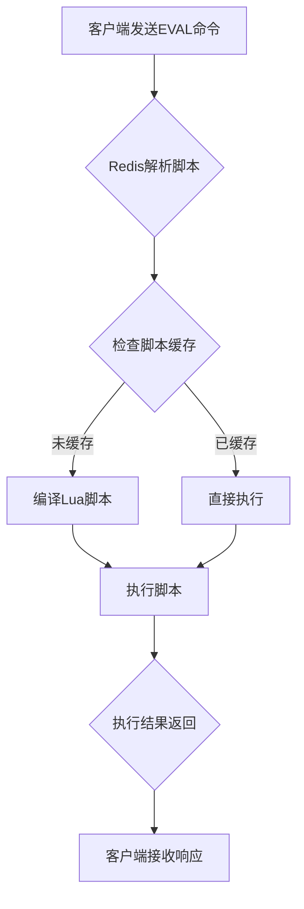

# 问题：Redis Lua脚本执行
回答如下：
「Redis Lua脚本执行」 请根据以下内容：
Redis支持在服务器端执行Lua脚本，通过EVAL命令执行。Lua脚本可以包含复杂逻辑，保证原子性，减少网络往返。适合实现分布式锁、复杂计数等场景。
 细化回答: 
 要求：1. 回答要详细，内容丰富，实践与理论结合！2. 采用总分总的文章思路！3、适当进行图示说明# Redis Lua脚本执行详解：从原理到实践

## 总述：Redis Lua脚本的核心价值

Redis作为高性能的内存数据库，其核心优势不仅在于数据存储的高速访问，更在于通过Lua脚本机制实现复杂业务逻辑的原子性执行。Lua脚本在Redis中的执行机制，将传统客户端-服务器模式下的网络往返开销降至最低，同时确保了操作的原子性，成为分布式系统中实现复杂业务逻辑的重要工具。

## 分述：深入理解Redis Lua脚本执行机制

### 1. Lua脚本执行原理与优势

Redis的Lua脚本执行基于以下核心机制：

```
客户端发送EVAL命令 → Redis服务器解析Lua脚本 → 执行脚本内容 → 返回结果
```

**关键优势包括：**
- **原子性保证**：整个脚本作为一个整体执行，中间不会被其他命令打断
- **网络优化**：减少客户端与服务器间的往返次数
- **逻辑封装**：复杂业务逻辑可以封装在服务端，降低客户端复杂度

### 2. 核心命令详解

#### EVAL命令语法：
```redis
EVAL script numkeys key [key ...] arg [arg ...]
```

#### 实际应用示例：

**简单计数器脚本：**
```lua
-- 增加计数器并返回新值
local current = redis.call('INCR', KEYS[1])
return current
```

**分布式锁实现：**
```lua
-- Lua脚本实现分布式锁
local key = KEYS[1]
local lock_value = ARGV[1]
local expire_time = tonumber(ARGV[2])

-- 尝试获取锁
if redis.call('SETNX', key, lock_value) == 1 then
    redis.call('EXPIRE', key, expire_time)
    return 1
else
    return 0
end
```

### 3. 执行流程分析



### 4. 实际应用场景

#### 场景一：复杂计数器实现
```lua
-- 实现带过期时间的计数器
local key = KEYS[1]
local increment = tonumber(ARGV[1])
local expire_time = tonumber(ARGV[2])

-- 增加计数并设置过期时间
local current = redis.call('INCRBY', key, increment)
redis.call('EXPIRE', key, expire_time)

return current
```

#### 场景二：事务性操作
```lua
-- 原子性处理用户积分变化
local user_key = KEYS[1]
local points_key = KEYS[2]
local points = tonumber(ARGV[1])

-- 检查用户是否存在且积分充足
local user_exists = redis.call('EXISTS', user_key)
if user_exists == 0 then
    return {err = "User not found"}
end

local current_points = redis.call('GET', points_key)
if current_points < points then
    return {err = "Insufficient points"}
end

-- 扣减积分并更新用户状态
redis.call('DECRBY', points_key, points)
redis.call('HSET', user_key, 'last_transaction', redis.call('TIME')[1])

return {success = true, remaining_points = current_points - points}
```

### 5. 性能优化要点

#### 缓存机制：
```lua
-- 使用SCRIPT LOAD预加载脚本
SCRIPT LOAD "return redis.call('GET', KEYS[1])"
```

#### 脚本长度控制：
- 避免过长的脚本，建议控制在几KB以内
- 复杂逻辑可拆分为多个小脚本组合使用

### 6. 安全性考虑

```lua
-- 限制脚本中的危险操作
-- 禁止使用以下命令：
-- redis.call('FLUSHDB')
-- redis.call('FLUSHALL') 
-- redis.call('CONFIG')
```

## 总结：Lua脚本在Redis中的价值与应用前景

Redis Lua脚本执行机制通过将复杂业务逻辑下沉到服务器端，实现了真正的原子性操作和网络性能优化。从分布式锁的实现到复杂的计数器处理，从事务性操作到批量数据处理，Lua脚本为Redis用户提供了强大的扩展能力。

**核心价值体现：**
1. **性能提升**：减少网络往返，提高执行效率
2. **原子保障**：确保复杂操作的完整性
3. **灵活性强**：支持丰富的Lua语言特性
4. **易维护性**：业务逻辑集中管理

随着微服务架构和分布式系统的发展，Redis Lua脚本将成为构建高性能、高可用应用的重要技术手段。合理运用Lua脚本，不仅能够提升系统的响应速度，还能有效降低系统复杂度，是现代分布式应用开发中不可或缺的利器。

通过本文的详细解析，读者应该能够深入理解Redis Lua脚本的工作原理，并在实际项目中灵活运用这一强大功能来解决复杂的业务需求。[DONE]