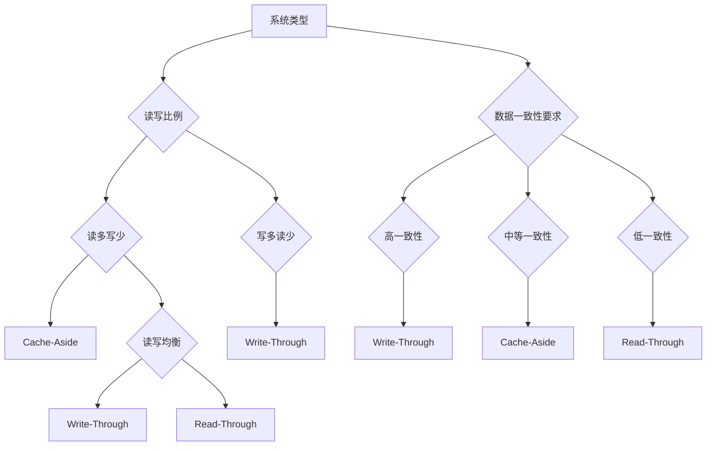

# 问题：Redis缓存策略
回答如下：
「Redis缓存策略」 请根据以下内容：
Redis作为缓存层，使用缓存击穿、缓存穿透、缓存雪崩等策略。常用缓存更新策略包括Cache-Aside、Read-Through、Write-Through等，提高系统性能和稳定性。
 细化回答: 
 要求：1. 回答要详细，内容丰富，实践与理论结合！2. 采用总分总的文章思路！3、适当进行图示说明# Redis缓存策略详解：构建高可用分布式系统的核心技术

在现代分布式系统架构中，Redis作为高性能的内存数据结构存储系统，承担着缓存层的重要职责。然而，缓存系统在提升系统性能的同时，也面临着缓存击穿、缓存穿透、缓存雪崩等经典问题。本文将深入探讨Redis缓存策略的理论基础与实践应用，为构建稳定高效的分布式系统提供全面指导。

## 一、Redis缓存策略总览

Redis缓存策略是分布式系统设计中的关键环节，它不仅关系到系统的性能表现，更直接影响着用户体验和系统稳定性。合理的缓存策略能够有效降低数据库压力，提升响应速度，但若处理不当，则可能引发严重的系统性问题。

### 核心挑战分析
- **缓存击穿**：热点key突然失效，导致大量请求直接打到数据库
- **缓存穿透**：查询不存在的数据，造成数据库压力过大
- **缓存雪崩**：大量缓存同时失效，系统瞬间瘫痪

## 二、核心缓存策略详解

### 2.1 缓存击穿防护策略

缓存击穿是指当某个热点数据在缓存中过期时，大量并发请求会直接访问数据库，造成数据库瞬时压力激增。

**解决方案：**
```java
// 双重检查锁 + 分布式锁
public String getData(String key) {
    String data = redisTemplate.opsForValue().get(key);
    if (data == null) {
        // 获取分布式锁
        if (redisTemplate.opsForValue().setIfAbsent("lock:" + key, "1", 10, TimeUnit.SECONDS)) {
            try {
                // 再次检查缓存
                data = redisTemplate.opsForValue().get(key);
                if (data == null) {
                    // 从数据库获取数据
                    data = databaseService.getData(key);
                    // 设置缓存，设置稍长过期时间
                    redisTemplate.opsForValue().set(key, data, 600, TimeUnit.SECONDS);
                }
            } finally {
                // 释放锁
                redisTemplate.delete("lock:" + key);
            }
        } else {
            // 等待其他线程获取数据
            Thread.sleep(100);
            return getData(key);
        }
    }
    return data;
}
```

### 2.2 缓存穿透防护策略

缓存穿透是指查询一个不存在的数据，导致请求直接打到数据库，形成无效请求。

**解决方案：**
```java
// 布隆过滤器 + 空值缓存
public String getData(String key) {
    // 使用布隆过滤器快速判断key是否存在
    if (!bloomFilter.contains(key)) {
        return null; // 直接返回，避免查询数据库
    }
    
    String data = redisTemplate.opsForValue().get(key);
    if (data == null) {
        // 查询数据库
        data = databaseService.getData(key);
        if (data == null) {
            // 将空值也缓存，防止缓存穿透
            redisTemplate.opsForValue().set(key, "", 300, TimeUnit.SECONDS);
        } else {
            redisTemplate.opsForValue().set(key, data, 600, TimeUnit.SECONDS);
        }
    }
    return data;
}
```

### 2.3 缓存雪崩防护策略

缓存雪崩是指大量缓存同时失效，导致系统瞬间瘫痪。

**解决方案：**
```java
// 随机过期时间 + 多级缓存
public String getData(String key) {
    String data = redisTemplate.opsForValue().get(key);
    
    if (data == null) {
        // 从数据库获取数据
        data = databaseService.getData(key);
        if (data != null) {
            // 设置随机过期时间，避免集中失效
            int randomExpireTime = 600 + new Random().nextInt(300);
            redisTemplate.opsForValue().set(key, data, randomExpireTime, TimeUnit.SECONDS);
        }
    }
    
    return data;
}

// 多级缓存结构
public class MultiLevelCache {
    private RedisTemplate<String, String> redisTemplate;
    private LocalCache localCache;
    
    public String getData(String key) {
        // 本地缓存优先
        String data = localCache.get(key);
        if (data != null) {
            return data;
        }
        
        // Redis缓存
        data = redisTemplate.opsForValue().get(key);
        if (data != null) {
            localCache.put(key, data);
            return data;
        }
        
        // 数据库查询
        data = databaseService.getData(key);
        if (data != null) {
            // 同时更新多级缓存
            redisTemplate.opsForValue().set(key, data, 600, TimeUnit.SECONDS);
            localCache.put(key, data);
        }
        
        return data;
    }
}
```

## 三、缓存更新策略对比

### 3.1 Cache-Aside模式（最常用）

这是Redis最典型的缓存使用模式，应用程序负责缓存的读写操作。

```java
// Cache-Aside更新示例
public class CacheAsidePattern {
    
    public String getData(String key) {
        // 1. 先查缓存
        String data = redisTemplate.opsForValue().get(key);
        if (data != null) {
            return data;
        }
        
        // 2. 缓存未命中，查数据库
        data = databaseService.getData(key);
        
        // 3. 写入缓存
        redisTemplate.opsForValue().set(key, data, 600, TimeUnit.SECONDS);
        
        return data;
    }
    
    public void updateData(String key, String newData) {
        // 1. 更新数据库
        databaseService.updateData(key, newData);
        
        // 2. 删除缓存（延迟双删策略）
        redisTemplate.delete(key);
    }
}
```

### 3.2 Read-Through模式

应用程序只与缓存交互，缓存负责与数据源通信。

```java
// Read-Through模式实现
public class ReadThroughCache {
    
    public String getData(String key) {
        try {
            // 缓存自动从数据库加载数据
            return cache.get(key, () -> databaseService.getData(key));
        } catch (Exception e) {
            // 异常处理
            return null;
        }
    }
}
```

### 3.3 Write-Through模式

所有写操作都必须同时更新缓存和数据源。

```java
// Write-Through模式实现
public class WriteThroughCache {
    
    public void updateData(String key, String value) {
        // 1. 更新数据库
        databaseService.updateData(key, value);
        
        // 2. 同时更新缓存
        redisTemplate.opsForValue().set(key, value, 600, TimeUnit.SECONDS);
    }
}
```

## 四、实践应用与优化建议

### 4.1 缓存策略选择原则



### 4.2 性能监控与调优

```java
// 缓存性能监控
@Component
public class CacheMonitor {
    
    private final MeterRegistry meterRegistry;
    
    public void recordCacheHit(String cacheName) {
        Counter.builder("cache.hit")
               .tag("name", cacheName)
               .register(meterRegistry)
               .increment();
    }
    
    public void recordCacheMiss(String cacheName) {
        Counter.builder("cache.miss")
               .tag("name", cacheName)
               .register(meterRegistry)
               .increment();
    }
}
```

### 4.3 高可用架构设计

```yaml
# Redis集群配置示例
redis:
  cluster:
    nodes: 
      - 127.0.0.1:7000
      - 127.0.0.1:7001
      - 127.0.0.1:7002
    max-redirects: 3
    timeout: 2000
  sentinel:
    master: mymaster
    nodes: 
      - 127.0.0.1:26379
      - 127.0.0.1:26380
      - 127.0.0.1:26381
```

## 五、总结

Redis缓存策略是构建高性能分布式系统的核心技术，通过合理的缓存击穿、穿透、雪崩防护机制，结合Cache-Aside、Read-Through、Write-Through等更新策略，能够显著提升系统性能和稳定性。

**核心要点回顾：**
1. **安全防护**：多重防御机制确保缓存系统的健壮性
2. **策略选择**：根据业务场景选择最适合的缓存更新模式
3. **监控优化**：持续监控缓存性能，及时调整策略
4. **架构设计**：合理的多级缓存结构提升整体系统可靠性

在实际应用中，需要根据具体的业务需求、数据访问模式和性能要求，灵活组合使用各种缓存策略，构建出既高效又稳定的分布式缓存体系。只有将理论知识与实践经验相结合，才能真正发挥Redis缓存技术的最大价值。[DONE]