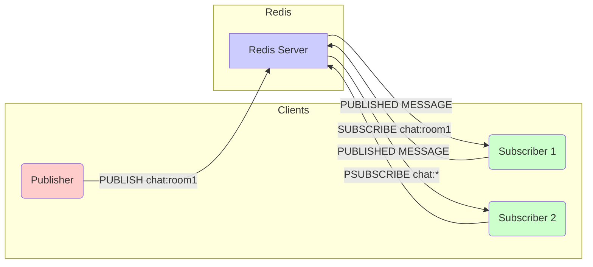

# 问题：Redis发布-订阅模式
回答如下：
「Redis发布-订阅模式」 请根据以下内容：
Redis提供pub/sub功能实现消息发布和订阅，使用publish和subscribe命令。客户端可以订阅特定频道，发布者向频道发送消息，实现系统模块间的解耦和异步通信。
 细化回答: 
 要求：1. 回答要详细，内容丰富，实践与理论结合！2. 采用总分总的文章思路！3、适当进行图示说明# Redis 发布‑订阅（Pub/Sub）模式  

> **Redis Pub/Sub** 是 Redis 的一项轻量级异步消息广播机制，支持“发布者 → 频道 → 订阅者”四步模型。  
> 它既可用于 **实时通信**（如聊天室、推送通知），也可作为 **服务解耦** 的桥梁（例如微服务间事件广播）。  
> 下面从理论、实践与最佳实践三方面进行系统阐述，并配以图示帮助直观理解。

---

## 1. 综述  

| 维度 | 说明 |
|------|------|
| **核心目标** | 在多个进程/节点之间实现 **即时广播**，无需轮询、无状态存储 |
| **适用场景** | ① 实时聊天、即时消息<br>② 监控告警、日志聚合<br>③ 业务事件广播、微服务解耦 |
| **优势** | ① 低延迟、实时性高<br>② 轻量、无消息持久化开销<br>③ 原生 Redis 支持，部署简单 |
| **局限** | ① 无消息持久化、无历史回放<br>② 无消息确认与重试<br>③ 只能在单机或单个节点上广播，集群模式需特殊处理 |

> **核心概念**  
> - **Publisher**：发布者，向 Redis 的某个 **channel** 发送消息  
> - **Subscriber**：订阅者，订阅一个或多个 **channel** 并实时接收消息  
> - **Channel**：消息传递的“路由”名称，纯字符串  
> - **Pattern channel**：使用通配符（`*`、`?`）进行模糊订阅

---

## 2. 细化解读  

### 2.1 基本命令

| 命令 | 作用 | 备注 |
|------|------|------|
| `PUBLISH channel message` | 发布消息 | 消息为字节流 |
| `SUBSCRIBE channel [channel ...]` | 订阅频道 | 连接进入**订阅模式**，不能再执行其它命令 |
| `UNSUBSCRIBE [channel ...]` | 取消订阅 | 订阅模式下执行 |
| `PSUBSCRIBE pattern [pattern ...]` | 订阅模式 | `*` 匹配任意长度字符，`?` 匹配单字符 |
| `PUNSUBSCRIBE [pattern ...]` | 取消模式订阅 | 订阅模式下执行 |
| `PING` | 服务器健康检查 | 可在任何连接中使用 |

> **注意**：**订阅连接**与普通连接互斥。**一次订阅连接只能执行 `SUBSCRIBE/UNSUBSCRIBE/PSUBSCRIBE/PUNSUBSCRIBE/PING` 等命令。**  
> **建议**：发布者与订阅者使用**独立连接**，否则发布消息会阻塞订阅事件。

---

### 2.2 典型工作流程

1. **订阅者**  
   ```text
   Subscriber 1  ---->  SUBSCRIBE chat:room1
   Subscriber 2  ---->  PSUBSCRIBE chat:*
   ```
2. **发布者**  
   ```text
   Publisher  ---->  PUBLISH chat:room1 "Hello, world!"
   ```
3. **Redis 服务器**  
   - 解析 `PUBLISH`  
   - 根据 channel 名称匹配 **所有** 订阅者  
   - 将消息推送给每个订阅连接

> **图示**（使用 Mermaid 语法，可在支持 Mermaid 的 Markdown 编辑器中渲染）  



---

### 2.3 代码实践  

#### 2.3.1 Python 示例（`redis-py`）

```python
# subscriber.py
import redis
import threading

def handle_message(message):
    print(f"[{message['channel'].decode()}] {message['data'].decode()}")

r = redis.Redis(host='localhost', port=6379, db=0)

# 订阅 channel
pubsub = r.pubsub()
pubsub.subscribe(**{'chat:room1': handle_message,
                    'chat:room2': handle_message})

# 处理消息线程
thread = pubsub.run_in_thread(sleep_time=0.001)
print("Subscribed. Press Ctrl+C to exit.")
try:
    while True:
        pass
except KeyboardInterrupt:
    thread.stop()
```

```python
# publisher.py
import redis
import time

r = redis.Redis(host='localhost', port=6379, db=0)

while True:
    msg = input("Enter message: ")
    r.publish('chat:room1', msg)
    time.sleep(0.1)
```

> **说明**  
> - `run_in_thread` 让订阅者在后台线程中监听消息，主线程可用于其它任务。  
> - `handle_message` 是回调函数，`message` 结构体包含 `type`、`pattern`、`channel`、`data` 等字段。  

#### 2.3.2 Node.js 示例（`ioredis`）

```javascript
// subscriber.js
const Redis = require('ioredis');
const redis = new Redis();

redis.psubscribe('chat:*', (err, count) => {
  if (err) return console.error(err);
  console.log(`Subscribed to ${count} patterns`);
});

redis.on('pmessage', (pattern, channel, message) => {
  console.log(`[${channel}] ${message}`);
});
```

```javascript
// publisher.js
const Redis = require('ioredis');
const redis = new Redis();
const readline = require('readline');

const rl = readline.createInterface({ input: process.stdin, output: process.stdout });

rl.on('line', (line) => {
  redis.publish('chat:room1', line);
});
```

> **实践技巧**  
> - **发布与订阅分离**：每个进程/服务使用单独的 Redis 连接。  
> - **心跳与断线重连**：在高可用部署中，可监听 `error`、`reconnect` 等事件。  
> - **消息序列化**：为避免编码冲突，可采用 JSON、Protocol Buffers 或 MessagePack。  

---

### 2.4 性能与局限  

| 维度 | 描述 | 影响 |
|------|------|------|
| **延迟** | 典型 < 1 ms（网络 + 内存） | 适合高频实时推送 |
| **吞吐量** | 单机 10 万条/秒（取决于 CPU、网络） | 大规模业务需水平扩展 |
| **持久化** | **无** | 订阅者离线时无法收到历史消息 |
| **可靠性** | **无** | 消息可能丢失（网络抖动、订阅者离线） |
| **集群支持** | 单节点或 **Redis Cluster** 下广播需要在所有节点上发布 | 可用 `cluster-announce` 或使用 `MGET` + `PUBLISH` 手工实现 |
| **消息确认** | **无** | 无 ack，无法实现“一致投递” |
| **资源占用** | 订阅连接消耗 1 kB 内存 | 10 万订阅连接会占用 ~100 MB |

> **结论**  
> Pub/Sub 适用于 **实时性高、消息丢失可接受** 的场景，如聊天、游戏实时状态。  
> 对于 **持久化、可靠性** 要求高的业务，可考虑 **Redis Streams** 或 **Kafka**、**RabbitMQ** 等专用消息队列。

---

### 2.5 与其它技术对比  

| 方案 | 主要特点 | 适用场景 | 优缺点 |
|------|----------|----------|--------|
| **Redis Pub/Sub** | 即时广播，轻量 | 聊天、实时监控 | 不持久、无 ack |
| **Redis Streams** | 有序队列，持久，消费者组 | 任务调度、日志聚合 | 较重，学习成本 |
| **Kafka** | 高吞吐量，分区，持久，消费者分组 | 大数据流、日志收集 | 部署复杂，资源占用 |
| **RabbitMQ** | 可靠投递，路由，确认机制 | 事务性任务、异步业务 | 额外开销，配置复杂 |

> **实战建议**  
> - **混合使用**：将 Pub/Sub 用作 “广播层”，Streams 负责 “任务队列”。  
> - **灰度实验**：先在非关键路径使用 Pub/Sub，观察丢包率，再迁移到持久化方案。

---

### 2.6 生产环境最佳实践  

1. **连接池**  
   - 发布者使用单一连接或连接池。  
   - 订阅者保持独立长连接，采用 `pubsub` 模式。

2. **心跳与监控**  
   - 通过 `PING` 或自定义心跳检测连接状态。  
   - 监控 `connected_clients`、`pubsub_channels`、`pubsub_patterns`。

3. **安全**  
   - 配置 `requirepass`、`acl`。  
   - 通过 TLS 加密传输（`redis-cli --tls`）。  

4. **集群策略**  
   - **单机**：最简单，低成本。  
   - **Cluster**：所有节点必须同时发布，否则只在发布节点广播。  
   - **多主方案**：使用 `Redis Sentinel` 或外部 Pub/Sub（如 NATS）进行跨节点广播。

5. **重连与异常处理**  
   - 订阅者在 `error` 或 `reconnect` 事件中重新订阅。  
   - 发布者在 `connection lost` 时可缓冲消息并重试。

6. **资源监控**  
   - `INFO` 命令可查看 `mem_fragmentation_ratio`、`blocked_clients`。  
   - 对 `pubsub` 客户端的 CPU、网络进行监控，避免单节点瓶颈。

---

## 3. 小结  

> **Redis Pub/Sub** 是一个 **轻量、低延迟、原生支持** 的即时广播方案。  
> 它通过“发布 → 频道 → 订阅”的三步模型，将服务间的 **异步通信** 与 **解耦** 实现得非常直观。  
> 但与此同时，它也存在 **无持久化、无确认、单机广播** 的局限。  
> 在实际部署时，需要根据业务对实时性、可靠性、可扩展性的要求，选择合适的组合：  
> - **纯实时场景** → 直接使用 Pub/Sub；  
> - **有持久化/重试需求** → 使用 **Redis Streams** 或外部消息队列；  
> - **大规模集群** → 采用多主方案或结合 **Redis Cluster + Pub/Sub** 方案。  

> **最重要**：在实现 Pub/Sub 时，始终遵循“发布与订阅分离、连接池管理、心跳监控、异常重连”这一最佳实践，才能保证系统的稳定性与可维护性。  

祝你在 Redis Pub/Sub 的实践中取得成功，构建更加高效、解耦的分布式系统！