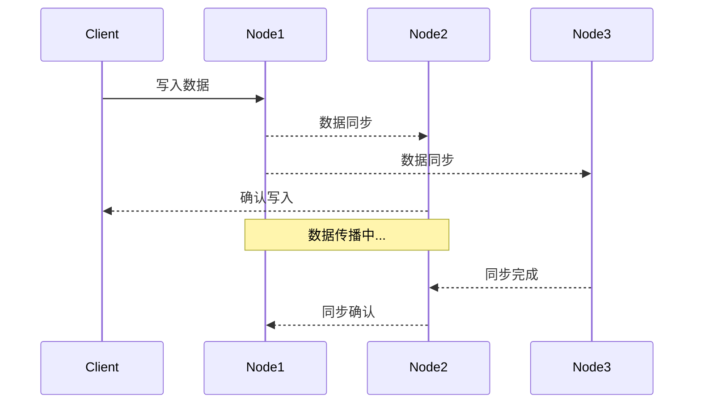
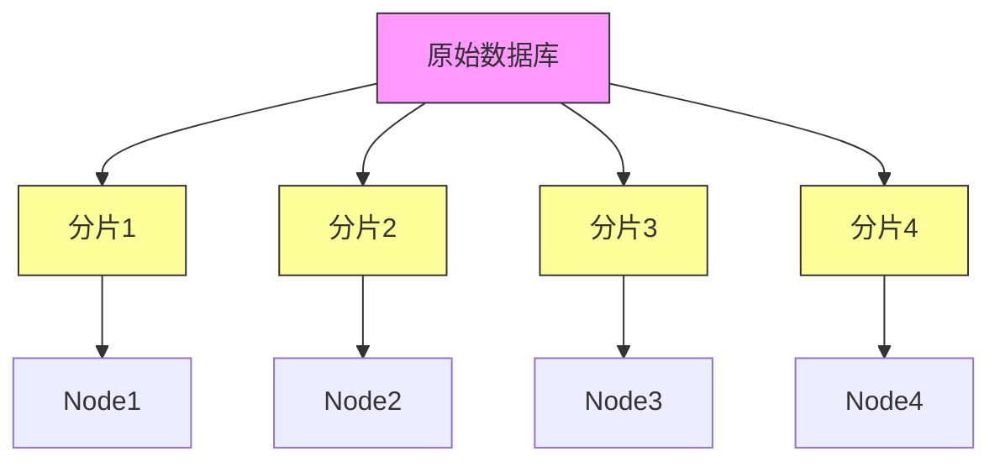
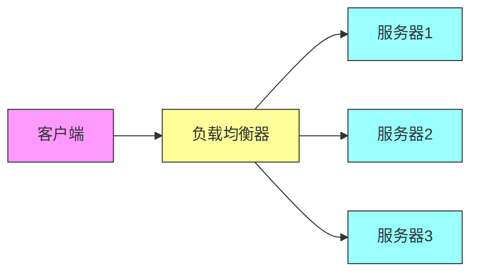
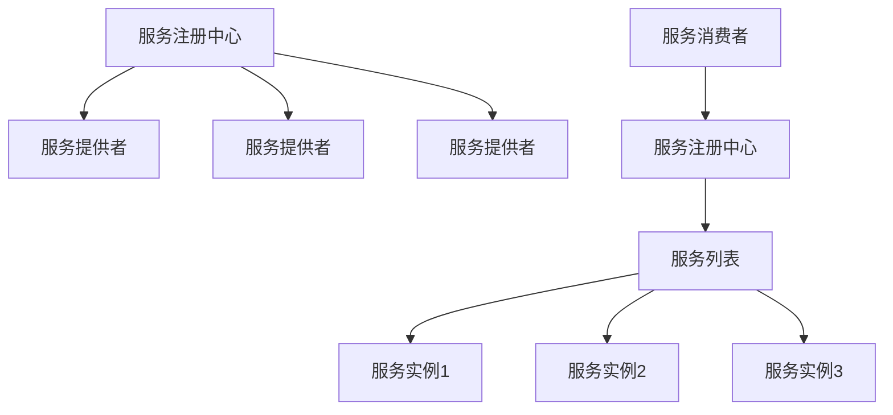
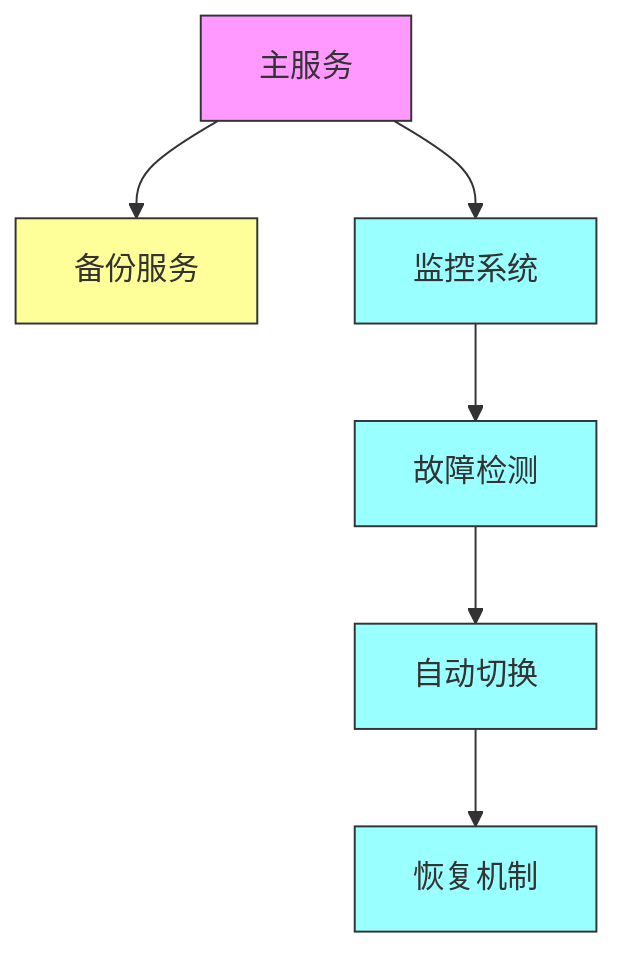
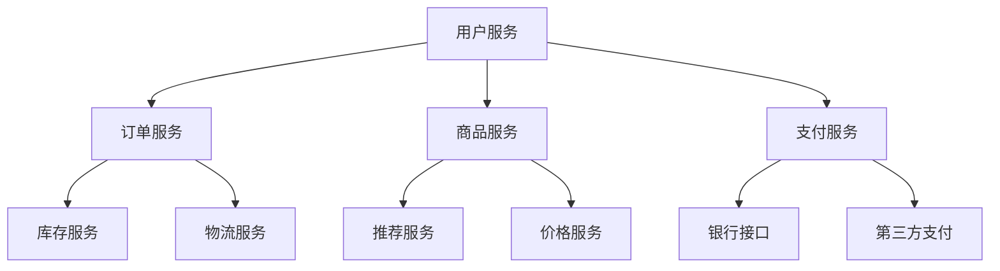
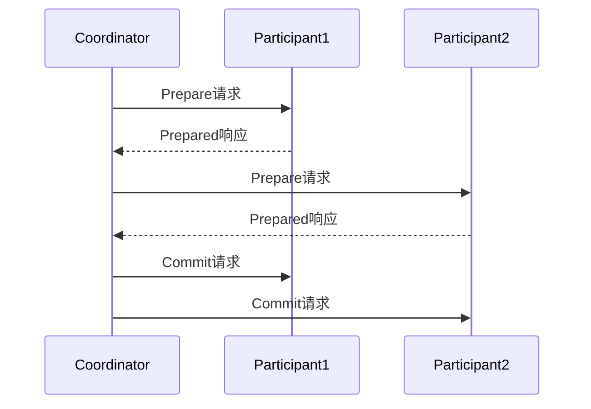

# 问题：分布式系统设计原则
回答如下：
「分布式系统设计原则」 请根据以下内容：
分布式系统设计需考虑CAP理论（一致性、可用性、分区容错性）、最终一致性、数据分片、负载均衡、服务发现和容错机制。设计时应权衡CAP，根据业务需求选择合适的策略，确保系统高可用性和可扩展性。
 细化回答: 
 要求：1. 回答要详细，内容丰富，实践与理论结合！2. 采用总分总的文章思路！3、适当进行图示说明

# 分布式系统设计原则详解

## 引言

在当今互联网时代，分布式系统已成为构建大规模应用的核心架构模式。从电商网站到社交媒体平台，从金融系统到云计算服务，无处不在的分布式系统正在改变着我们的数字生活。然而，分布式系统的复杂性远超单体系统，如何在保证系统性能、可靠性和可扩展性的同时，满足业务需求，是每个架构师面临的重大挑战。

本文将深入探讨分布式系统设计的核心原则，从理论基础到实践应用，为构建高可用、高性能的分布式系统提供全面指导。

## 一、CAP理论：分布式系统的基石

### 1.1 CAP理论的核心概念

CAP理论由计算机科学家Eric Brewer在2000年提出，指出在分布式系统中，**一致性（Consistency）**、**可用性（Availability）**和**分区容错性（Partition Tolerance）**三者不可兼得，最多只能同时满足其中两个。

```
CAP理论三要素关系图：
┌─────────────────────────────────────┐
│         分布式系统                   │
├─────────────────────────────────────┤
│ 一致性(C) │ 可用性(A) │ 分区容错(P) │
├─────────────────────────────────────┤
│    ○     │     ○     │     ○     │
│  数据同步 │ 服务响应 │ 网络分区   │
└─────────────────────────────────────┘
```

### 1.2 三者权衡分析

**一致性（Consistency）**：所有节点在同一时间看到相同的数据。这要求数据变更后立即同步到所有节点，但会增加系统复杂性和延迟。

**可用性（Availability）**：系统在任何时候都能响应用户请求。即使部分节点故障，服务仍能正常提供。

**分区容错性（Partition Tolerance）**：当网络出现分区时，系统仍能继续运行。这是分布式系统的必备特性，因为网络故障是不可避免的。

### 1.3 实际应用策略

在实际设计中，我们通常需要根据业务场景选择不同的组合：

- **CP系统**：金融交易、银行系统等对一致性要求极高的场景
- **AP系统**：社交网络、内容分发等对可用性要求较高的场景  
- **CA系统**：单机系统或小型集群，但现实中几乎不存在

## 二、核心设计原则详解

### 2.1 最终一致性模式

最终一致性是分布式系统中常用的一致性模型，它允许数据在一段时间内不一致，但保证最终会达到一致状态。



**实现策略**：
- **版本控制**：使用向量时钟或时间戳跟踪数据变更
- **冲突解决**：定义明确的合并规则（如最后写入获胜、删除标记等）
- **异步复制**：减少同步延迟，提高系统性能

### 2.2 数据分片策略

数据分片是实现分布式系统可扩展性的关键手段，通过将大数据集分散到多个节点上，提升系统处理能力。



**常见分片策略**：
- **哈希分片**：通过哈希算法计算数据存储位置
- **范围分片**：按数据值范围划分，如用户ID区间
- **一致性哈希**：减少节点变更时的数据迁移量

### 2.3 负载均衡机制

负载均衡是确保分布式系统高效运行的重要手段，通过合理分配请求到不同节点，避免单点过载。



**负载均衡算法**：
- **轮询算法**：按顺序分配请求
- **加权轮询**：根据服务器性能调整权重
- **最少连接**：将请求分配给当前连接数最少的服务器
- **响应时间**：基于服务器响应时间动态调整

### 2.4 服务发现机制

在动态环境中，服务发现确保系统能够自动发现和定位可用的服务实例。



**核心组件**：
- **服务注册**：服务启动时向注册中心注册
- **健康检查**：定期检测服务实例状态
- **服务发现**：消费者获取可用服务列表
- **负载均衡**：结合负载均衡器选择服务实例

### 2.5 容错机制设计

容错机制确保系统在部分组件故障时仍能正常运行，提高整体可靠性。



**容错策略**：
- **冗余设计**：关键组件多实例部署
- **超时重试**：避免长时间等待失败请求
- **熔断机制**：防止故障扩散
- **降级处理**：核心功能可用时提供简化服务

## 三、实践案例分析

### 3.1 微服务架构实践

以电商平台为例，采用微服务架构设计：



### 3.2 数据一致性实践

对于金融交易系统，采用两阶段提交（2PC）确保数据一致性：



## 四、设计原则总结

分布式系统设计是一个复杂的工程问题，需要在理论与实践之间找到平衡点。通过深入理解CAP理论，合理运用最终一致性、数据分片、负载均衡、服务发现和容错机制等核心原则，我们能够构建出既满足业务需求又具备高可用性和可扩展性的分布式系统。

**关键成功要素**：
1. **明确业务需求**：根据具体场景选择合适的CAP组合
2. **模块化设计**：将复杂系统分解为独立的服务模块
3. **监控告警**：建立完善的监控体系及时发现问题
4. **持续优化**：基于实际运行数据不断调整和优化系统

只有在充分理解分布式系统本质的基础上，结合具体业务场景，才能设计出真正优秀的分布式系统架构。这不仅是技术能力的体现，更是系统思维和工程实践能力的综合展现。[DONE]