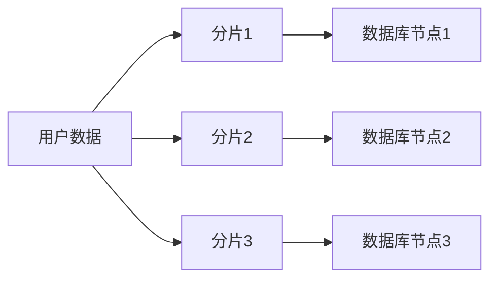
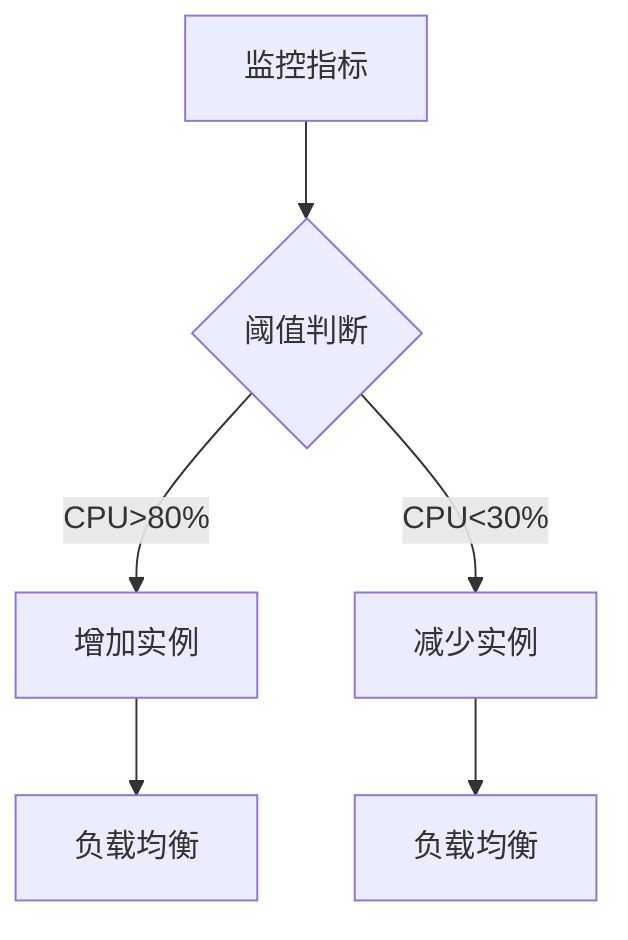

# 问题：可扩展性设计
回答如下：
「可扩展性设计」 请根据以下内容：
可扩展性设计包括水平扩展（增加节点）和垂直扩展（增强单节点能力）。设计时应考虑无状态服务、服务解耦、数据分片和自动伸缩机制，确保系统能随业务增长而扩展，避免单点瓶颈。
 细化回答: 
 要求：1. 回答要详细，内容丰富，实践与理论结合！2. 采用总分总的文章思路！3、适当进行图示说明# 可扩展性设计：构建未来可增长的系统架构

## 总述：可扩展性设计的核心价值

在当今数字化时代，系统的可扩展性已成为架构设计的核心考量因素。无论是电商平台的促销活动，还是社交媒体的爆发式增长，都对系统的扩展能力提出了严峻挑战。可扩展性设计不仅仅是技术层面的考量，更是业务持续发展的战略支撑。

可扩展性设计的核心目标是让系统能够灵活应对业务增长带来的各种挑战，通过水平扩展（增加节点）和垂直扩展（增强单节点能力）两种方式，确保系统在用户量、数据量、并发量等维度上都能平滑扩展。一个良好的可扩展性设计应该具备无状态服务、服务解耦、数据分片和自动伸缩机制等关键特征，从而避免单点瓶颈，实现系统的高可用性和高性能。

## 分述：可扩展性设计的关键要素详解

### 1. 水平扩展与垂直扩展的平衡策略

**水平扩展（Scale Out）** 是通过增加系统节点来提升处理能力的方式。这种扩展方式具有明显的优点：
- **成本效益高**：可以利用廉价的通用硬件
- **容错性强**：单点故障不影响整体系统
- **弹性好**：可以根据需求动态增减节点

**垂直扩展（Scale Up）** 则是通过提升单个节点的处理能力来增强性能：
- **实现简单**：无需改变现有架构
- **延迟低**：数据访问路径短
- **一致性好**：共享内存和缓存优化

在实际设计中，应该采用"水平扩展为主，垂直扩展为辅"的策略。例如，在电商系统中，用户服务可以采用水平扩展来处理大量并发请求，而数据库则可以在必要时进行垂直扩展以提升单节点处理能力。

### 2. 无状态服务的核心作用

无状态服务是可扩展设计的基础原则之一。所谓无状态，是指服务实例不保存客户端的会话信息，所有必要的状态都存储在外部系统（如数据库、缓存）中。

**实现方式：**
```
传统有状态架构：
┌─────────┐    ┌─────────┐    ┌─────────┐
│  用户A  │───▶│  应用A  │───▶│  数据库 │
└─────────┘    │  会话   │    └─────────┘
               │  状态   │
               └─────────┘

无状态架构：
┌─────────┐    ┌─────────┐    ┌─────────┐
│  用户A  │───▶│  应用A  │───▶│  数据库 │
└─────────┘    │         │    └─────────┘
               │         │
               └─────────┘
```

**优势体现：**
- **负载均衡简单**：任意实例都可以处理任何请求
- **故障恢复快**：实例故障不影响其他实例
- **部署灵活**：可以随时增减服务实例

### 3. 服务解耦的架构实践

服务解耦是实现系统可扩展性的关键手段，通过将复杂的系统拆分为独立的服务模块，每个服务都可以独立开发、部署和扩展。

**微服务架构示例：**
```
┌─────────────┐    ┌─────────────┐    ┌─────────────┐
│   用户服务  │    │   订单服务  │    │   支付服务  │
└─────────────┘    └─────────────┘    └─────────────┘
       │                   │                   │
       └───────────────────┼───────────────────┘
                           │
                ┌─────────────────┐
                │   API网关       │
                └─────────────────┘
                           │
                    ┌─────────────┐
                    │  业务服务层 │
                    └─────────────┘
```

**解耦的好处：**
- **独立扩展**：各服务可根据需求独立扩展
- **技术栈灵活**：不同服务可使用不同技术栈
- **故障隔离**：单个服务故障不影响其他服务

### 4. 数据分片的实现策略

数据分片是处理大数据量和高并发访问的重要手段，通过将数据分布到多个节点上，实现负载分散。

**常见的分片策略：**
- **哈希分片**：根据键值的哈希值确定存储位置
- **范围分片**：按数据范围进行划分（如按时间、ID范围）
- **一致性哈希**：减少节点变更时的数据迁移



**实施要点：**
- **分片键选择**：需要考虑查询模式和数据分布
- **扩容策略**：设计合理的分片迁移机制
- **数据一致性**：确保跨分片操作的事务性

### 5. 自动伸缩机制的智能化部署

自动伸缩是现代云原生架构的核心能力，通过监控系统负载指标，自动调整资源分配。

**典型伸缩流程：**


**关键组件：**
- **监控系统**：实时收集性能指标
- **决策引擎**：根据策略制定伸缩决策
- **执行器**：自动创建/销毁资源实例

## 总结：构建可持续发展的系统架构

可扩展性设计是一个系统性的工程，需要从多个维度综合考虑。通过合理的水平与垂直扩展策略、无状态服务设计、服务解耦、数据分片和自动伸缩机制的有机结合，可以构建出既满足当前业务需求，又具备良好扩展能力的系统架构。

在实践中，我们应当：
1. **持续监控**：建立完善的监控体系，及时发现性能瓶颈
2. **定期评估**：定期评估系统扩展性，提前规划升级路径
3. **渐进式改造**：避免一次性大规模重构，采用渐进式改进策略
4. **技术选型**：选择支持良好扩展性的技术栈和架构模式

只有这样，才能确保系统在业务快速发展过程中始终保持良好的性能表现和用户体验，为企业的持续增长提供坚实的技术支撑。可扩展性设计不是一次性的任务，而是一个需要持续关注和优化的长期过程，它直接关系到系统的生命力和企业的竞争力。[DONE]