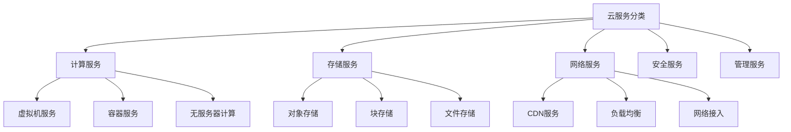
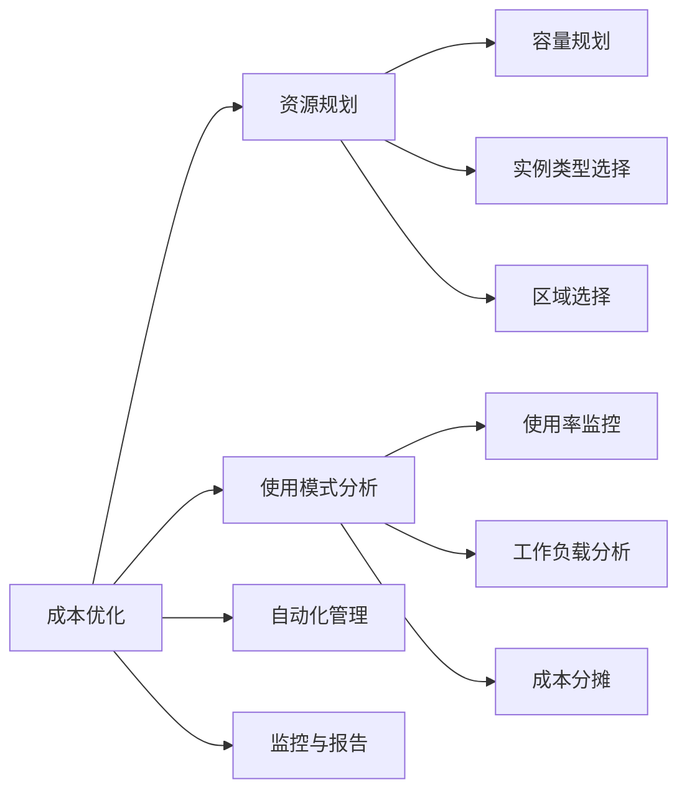
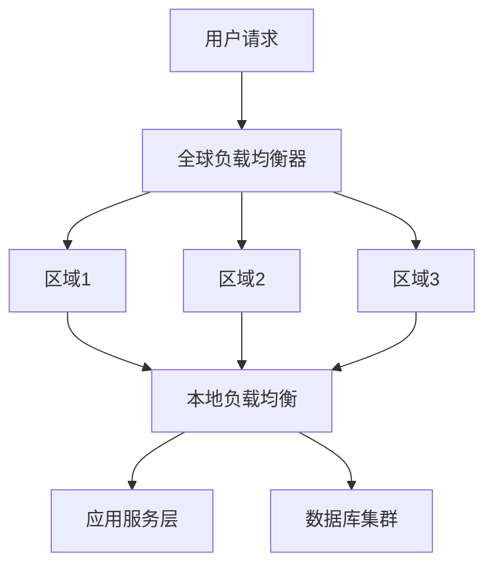
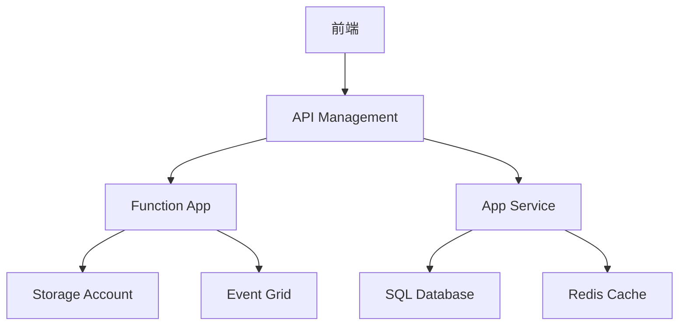

# 问题：基于云的系统设计
回答如下：
「基于云的系统设计」 请根据以下内容：
基于云的系统设计利用云平台（如AWS、Azure、阿里云）的弹性、可扩展性和托管服务。设计时需考虑云原生架构、服务选择、成本优化和跨区域部署。案例包括基于Azure的Bakery系统和小型企业系统。
 细化回答: 
 要求：1. 回答要详细，内容丰富，实践与理论结合！2. 采用总分总的文章思路！3、适当进行图示说明# 基于云的系统设计：构建现代分布式应用的核心策略

## 引言

在数字化转型浪潮中，基于云的系统设计已成为现代企业构建和部署应用的核心策略。随着云计算技术的快速发展，企业不再需要投入巨额资金购买和维护昂贵的硬件设备，而是可以通过云平台快速构建可扩展、高可用的应用系统。本文将深入探讨基于云的系统设计的核心要素，通过理论分析与实际案例相结合的方式，为读者提供全面而实用的设计指导。

## 一、云原生架构的核心理念

### 1.1 云原生架构的本质

云原生架构是一种专门为云计算环境设计的应用架构模式，其核心理念是利用云平台提供的弹性、可扩展性和分布式特性。这种架构强调微服务、容器化、DevOps和持续交付等现代软件工程实践。

**关键特征包括：**
- **微服务化**：将单体应用拆分为独立的、可独立部署的服务
- **容器化部署**：使用Docker等容器技术实现环境一致性
- **弹性伸缩**：根据负载自动调整资源分配
- **分布式设计**：采用分布式计算和存储策略

### 1.2 云原生架构的优势

云原生架构通过以下方式为企业创造价值：
- **快速迭代**：支持敏捷开发和持续集成/持续部署（CI/CD）
- **成本优化**：按需付费，避免资源浪费
- **高可用性**：通过分布式部署实现容错能力
- **全球部署**：支持跨区域业务扩展

## 二、云平台服务选择策略

### 2.1 服务分类与选择原则

在云平台上，服务可以分为以下几类：

### 2.2 典型服务选择示例

以Azure为例，针对不同业务需求选择合适的服务：

**计算服务选择：**
- **虚拟机**：适用于传统应用迁移
- **Azure Container Instances**：轻量级容器部署
- **Azure Kubernetes Service (AKS)**：复杂微服务架构
- **Azure Functions**：事件驱动的无服务器计算

**存储服务选择：**
- **Blob Storage**：非结构化数据存储
- **Cosmos DB**：全球分布式数据库
- **SQL Database**：关系型数据管理

## 三、成本优化策略

### 3.1 成本控制的核心要素

云成本优化需要从多个维度进行考虑：

### 3.2 具体优化措施

**资源规划优化：**
- 使用预留实例（Reserved Instances）降低长期成本
- 采用自动伸缩组避免资源闲置
- 实施多区域部署策略减少网络延迟成本

**使用模式分析：**
- 定期审查服务使用情况
- 实施成本分配标签（Cost Allocation Tags）
- 建立成本预算和预警机制

## 四、跨区域部署实践

### 4.1 多区域部署的必要性

现代应用需要在全球范围内提供服务，跨区域部署能够：
- **提高可用性**：避免单点故障
- **降低延迟**：就近提供服务
- **满足合规要求**：数据本地化需求
- **优化成本**：选择最优区域部署

### 4.2 部署架构设计

## 五、实际案例分析

### 5.1 基于Azure的Bakery系统设计

#### 系统需求分析
某烘焙企业需要构建一个在线订单系统，要求：
- 支持高并发订单处理
- 实现全球业务扩展
- 保证数据安全和备份
- 控制运营成本

#### 架构设计方案

**前端层：**
- Azure Static Web Apps：托管Web应用
- CDN加速全球访问
- 移动端应用使用Azure Mobile Apps

**后端层：**

**核心服务组件：**
1. **订单处理服务**：使用Azure Functions实现事件驱动
2. **库存管理**：基于Cosmos DB的分布式数据库
3. **用户认证**：Azure Active Directory集成
4. **消息队列**：Azure Service Bus处理异步通信

#### 技术选型决策
- **计算资源**：混合使用虚拟机和无服务器计算
- **存储方案**：Blob Storage存储图片，Cosmos DB存储订单数据
- **安全措施**：集成Azure Security Center进行威胁防护
- **监控工具**：Application Insights实现应用性能监控

### 5.2 小型企业系统设计

#### 典型需求场景
小型企业需要：
- 低成本的IT基础设施
- 灵活的业务扩展能力
- 简化的管理流程
- 安全可靠的数据保护

#### 设计原则
1. **成本效益优先**：选择合适的云服务套餐
2. **易用性设计**：简化运维流程
3. **可扩展性考虑**：预留升级空间
4. **安全性保障**：实施多层次安全防护

## 六、实施最佳实践

### 6.1 设计阶段要点

**架构设计原则：**
- 遵循松耦合设计原则
- 实施高可用性和容错机制
- 考虑服务间的依赖关系
- 制定详细的部署文档

**技术选型指南：**
- 评估云服务商的SLA承诺
- 考虑迁移成本和复杂度
- 确保技术栈的兼容性
- 建立技术债务管理机制

### 6.2 部署与运维

**自动化部署流程：**

**监控与维护：**
- 建立完善的日志收集系统
- 实施性能指标监控
- 定期进行安全审计
- 制定应急预案和回滚方案

## 结论

基于云的系统设计不仅是技术选择的问题，更是企业数字化转型的战略决策。通过合理运用云原生架构理念、科学选择云服务、实施有效的成本优化策略以及精心规划跨区域部署，企业能够构建出既满足当前业务需求又具备良好扩展性的现代化应用系统。

在实际应用中，成功的设计需要综合考虑技术可行性、业务需求、成本控制和安全合规等多个因素。随着云计算技术的不断发展，基于云的系统设计将继续演进，为企业创造更大的价值。未来的发展趋势将更加注重智能化运维、自动化管理以及更精细的成本控制，这要求我们持续学习和适应新的技术和最佳实践。

通过本文的分析和案例展示，希望能为读者提供有价值的参考，帮助企业在云原生时代更好地规划和实施系统设计，实现业务的可持续发展。[DONE]