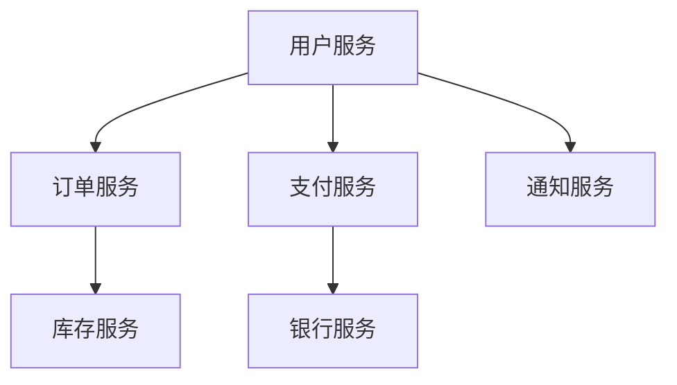
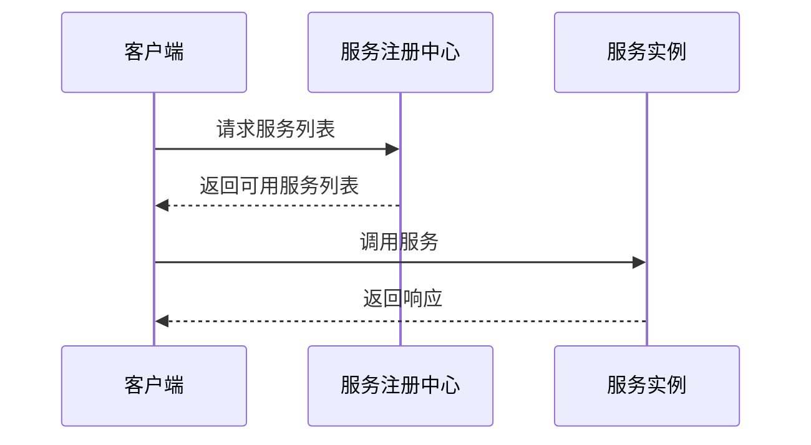

# 问题：微服务架构设计
回答如下：
「微服务架构设计」 请根据以下内容：
微服务架构将系统拆分为多个独立部署的服务，每个服务运行在自己的进程中，通过轻量级通信机制（如HTTP/REST、gRPC）进行交互。设计时需考虑服务边界划分、数据一致性、服务发现、容错和监控，确保系统可维护性和可扩展性。
 细化回答: 
 要求：1. 回答要详细，内容丰富，实践与理论结合！2. 采用总分总的文章思路！3、适当进行图示说明# 微服务架构设计详解

## 总述：微服务架构的核心价值

微服务架构作为现代软件开发的重要范式，正在重塑我们构建和部署应用的方式。它通过将传统的单体应用拆分为多个小型、独立的服务，实现了系统在可扩展性、可维护性和技术灵活性方面的重大突破。每个微服务都是一个独立的业务单元，拥有自己的数据存储、业务逻辑和部署能力，这种设计模式让组织能够快速响应市场变化，提高开发效率，并降低系统风险。

## 分述：微服务架构设计的核心要素

### 1. 服务边界划分策略

服务边界的合理划分是微服务架构成功的关键。好的服务边界应该遵循以下原则：

**业务驱动原则**：服务划分应基于业务领域，确保每个服务负责一个明确的业务功能。例如，在电商平台中，用户管理、订单处理、支付系统、库存管理等应分别作为独立服务。

**单一职责原则**：每个微服务应该只负责一个特定的业务功能，避免服务间的过度耦合。

**高内聚低耦合**：服务内部的组件应该高度相关，而服务之间应该保持松散耦合。

### 2. 数据一致性保障机制

在微服务架构中，每个服务通常拥有独立的数据存储，这带来了数据一致性的挑战。主要的解决方案包括：

**Saga模式**：通过一系列本地事务来处理分布式事务，每个服务提交自己的本地事务，如果某个步骤失败，则执行补偿操作。

**事件驱动架构**：服务间通过发布/订阅机制进行通信，当一个服务完成操作后，会发布相应的事件，其他服务监听这些事件并作出响应。

**最终一致性**：允许系统在一段时间内出现数据不一致的情况，但最终会达到一致状态。

### 3. 服务发现与注册机制

微服务的动态特性要求具备完善的服务发现机制：

**服务注册中心**：如Eureka、Consul、Nacos等，负责服务的注册与发现。服务启动时向注册中心注册自身信息，消费者通过注册中心获取可用服务列表。

**负载均衡策略**：支持轮询、权重、响应时间等多种负载均衡算法，确保请求能够合理分配到各个服务实例。

### 4. 容错与弹性设计

微服务架构需要具备强大的容错能力：

**熔断器模式**：当某个服务调用失败率达到阈值时，自动切断对该服务的请求，避免故障扩散。

**降级策略**：在系统压力过大时，暂时关闭非核心功能，保证核心业务正常运行。

**超时机制**：为服务调用设置合理的超时时间，避免长时间等待导致资源耗尽。

### 5. 监控与追踪体系

完善的监控是微服务运维的基础：

**分布式追踪**：使用如Zipkin、Jaeger等工具跟踪请求在微服务间的流转路径。

**指标收集**：监控服务的响应时间、吞吐量、错误率等关键指标。

**日志聚合**：统一收集和分析各服务的日志信息。

## 总结：构建成功的微服务架构

微服务架构设计是一个复杂的系统工程，需要在技术选型、业务理解、运维能力等多个维度进行综合考虑。成功的微服务架构不仅能够提升系统的可扩展性和可维护性，还能加速业务创新。然而，它也带来了复杂性增加、运维成本上升等挑战。

关键在于找到适合自己业务场景的平衡点：既要有足够的灵活性来支持快速迭代，又要保持系统的稳定性和可靠性。通过合理的架构设计、成熟的技术工具和完善的运维体系，微服务架构能够为企业数字化转型提供强有力的支持。

**核心建议**：
1. 从简单的业务领域开始实践微服务
2. 建立完善的服务治理机制
3. 投资建设强大的监控和运维能力
4. 培养跨职能的团队协作文化

只有这样，才能真正发挥微服务架构的价值，构建出既高效又可靠的现代应用系统。[DONE]