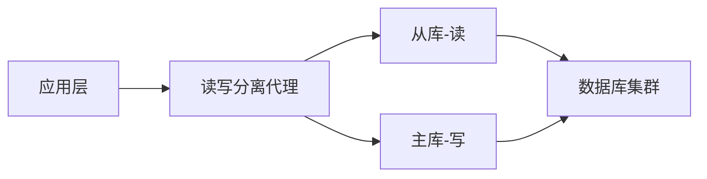
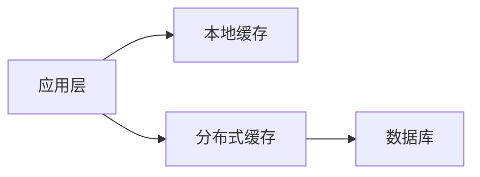

# 问题：数据库设计原则
回答如下：
「数据库设计原则」 请根据以下内容：
数据库设计应遵循规范化理论，避免数据冗余，确保数据完整性。需考虑表结构设计、索引优化、分库分表策略、读写分离和缓存设计。合理设计数据库能显著提高系统性能和可维护性。
 细化回答: 
 要求：1. 回答要详细，内容丰富，实践与理论结合！2. 采用总分总的文章思路！3、适当进行图示说明# 数据库设计原则详解

## 总述

数据库设计是构建高效、稳定、可扩展应用系统的基础环节。一个优秀的数据库设计方案不仅能够确保数据的完整性和一致性，还能显著提升系统的性能和可维护性。在现代软件开发中，随着业务复杂度的增加和数据量的爆炸式增长，合理的数据库设计原则显得尤为重要。本文将从规范化理论、表结构设计、索引优化、分库分表策略等多个维度深入探讨数据库设计的核心原则。

## 分述

### 一、规范化理论与数据冗余控制

#### 1.1 规范化理论概述
规范化是数据库设计中的核心理论，由埃德加·科德提出。其主要目标是消除数据冗余，减少更新异常，确保数据一致性。规范化过程通过一系列的范式（Normal Forms）来实现：

- **第一范式（1NF）**：确保每个字段都是原子性的，不可再分
- **第二范式（2NF）**：在满足1NF的基础上，消除部分函数依赖
- **第三范式（3NF）**：在满足2NF的基础上，消除传递函数依赖

#### 1.2 实际应用案例
```sql
-- 不规范的设计（存在冗余）
CREATE TABLE orders(
    order_id INT,
    customer_name VARCHAR(50),
    customer_address VARCHAR(100),
    product_name VARCHAR(50),
    quantity INT,
    price DECIMAL(10,2)
);

-- 规范化设计
CREATE TABLE customers(
    customer_id INT PRIMARY KEY,
    customer_name VARCHAR(50),
    customer_address VARCHAR(100)
);

CREATE TABLE products(
    product_id INT PRIMARY KEY,
    product_name VARCHAR(50),
    price DECIMAL(10,2)
);

CREATE TABLE orders(
    order_id INT PRIMARY KEY,
    customer_id INT,
    order_date DATE,
    FOREIGN KEY (customer_id) REFERENCES customers(customer_id)
);
```

### 二、表结构设计原则

#### 2.1 字段设计规范
- **数据类型选择**：根据实际需求选择合适的数据类型，避免过度占用存储空间
- **主键设计**：优先使用自增ID或UUID作为主键，确保唯一性和有序性
- **索引字段**：合理设置索引，平衡查询性能与写入性能

#### 2.2 表关系设计
```sql
-- 示例：用户-订单-商品的三级关联关系
CREATE TABLE users(
    user_id BIGINT PRIMARY KEY AUTO_INCREMENT,
    username VARCHAR(50) UNIQUE NOT NULL,
    email VARCHAR(100) UNIQUE NOT NULL,
    created_at TIMESTAMP DEFAULT CURRENT_TIMESTAMP
);

CREATE TABLE orders(
    order_id BIGINT PRIMARY KEY AUTO_INCREMENT,
    user_id BIGINT,
    total_amount DECIMAL(10,2),
    status ENUM('pending', 'paid', 'shipped', 'completed'),
    created_at TIMESTAMP DEFAULT CURRENT_TIMESTAMP,
    FOREIGN KEY (user_id) REFERENCES users(user_id)
);

CREATE TABLE order_items(
    item_id BIGINT PRIMARY KEY AUTO_INCREMENT,
    order_id BIGINT,
    product_id INT,
    quantity INT,
    price DECIMAL(10,2),
    FOREIGN KEY (order_id) REFERENCES orders(order_id),
    FOREIGN KEY (product_id) REFERENCES products(product_id)
);
```

### 三、索引优化策略

#### 3.1 索引类型与应用场景
- **B+树索引**：最常用的索引类型，适用于范围查询和等值查询
- **哈希索引**：适合精确匹配查询，但不支持范围查询
- **全文索引**：用于文本搜索场景

#### 3.2 索引设计原则
```sql
-- 高效的索引设计示例
-- 1. 复合索引优化查询
CREATE INDEX idx_user_order_date ON orders(user_id, created_at);

-- 2. 覆盖索引减少回表
CREATE INDEX idx_user_status_created ON users(status, created_at);

-- 3. 唯一索引保证数据完整性
CREATE UNIQUE INDEX idx_email ON users(email);
```

### 四、分库分表策略

#### 4.1 水平分表策略
```sql
-- 用户表按ID分片
-- 表1: users_0 (user_id % 4 = 0)
-- 表2: users_1 (user_id % 4 = 1)
-- 表3: users_2 (user_id % 4 = 2)
-- 表4: users_3 (user_id % 4 = 3)

CREATE TABLE users_0 LIKE users;
CREATE TABLE users_1 LIKE users;
CREATE TABLE users_2 LIKE users;
CREATE TABLE users_3 LIKE users;
```

#### 4.2 垂直分表策略
将大字段或不常用字段分离到独立表中：
```sql
-- 原始用户表
CREATE TABLE users(
    user_id INT PRIMARY KEY,
    username VARCHAR(50),
    email VARCHAR(100),
    profile_text TEXT,  -- 大文本字段
    avatar_url VARCHAR(200)  -- 图片URL
);

-- 分解后
CREATE TABLE users_basic(
    user_id INT PRIMARY KEY,
    username VARCHAR(50),
    email VARCHAR(100)
);

CREATE TABLE users_profile(
    user_id INT PRIMARY KEY,
    profile_text TEXT,
    avatar_url VARCHAR(200),
    FOREIGN KEY (user_id) REFERENCES users_basic(user_id)
);
```

### 五、读写分离架构

#### 5.1 架构设计


#### 5.2 实现要点
- 主库负责写操作，从库负责读操作
- 同步延迟控制在可接受范围内
- 自动故障切换机制

### 六、缓存设计策略

#### 6.1 多级缓存架构


#### 6.2 缓存更新策略
- **Cache-Aside**：应用层控制缓存的读写
- **Write-Through**：写操作同时更新缓存和数据库
- **Write-Behind**：异步批量更新缓存

## 总结

优秀的数据库设计需要综合考虑规范化理论、表结构优化、索引策略、分库分表、读写分离和缓存等多个方面。通过合理的设计原则，我们能够构建出高性能、高可用、易维护的数据库系统。

在实际项目中，建议采用以下实践方法：
1. **分阶段设计**：从简单到复杂逐步优化
2. **性能监控**：持续监控数据库性能指标
3. **容量规划**：提前预估数据增长趋势
4. **文档化**：详细记录设计决策和变更历史

只有将理论知识与实际业务需求相结合，才能真正发挥数据库设计的价值，为整个应用系统的稳定运行奠定坚实基础。[DONE]