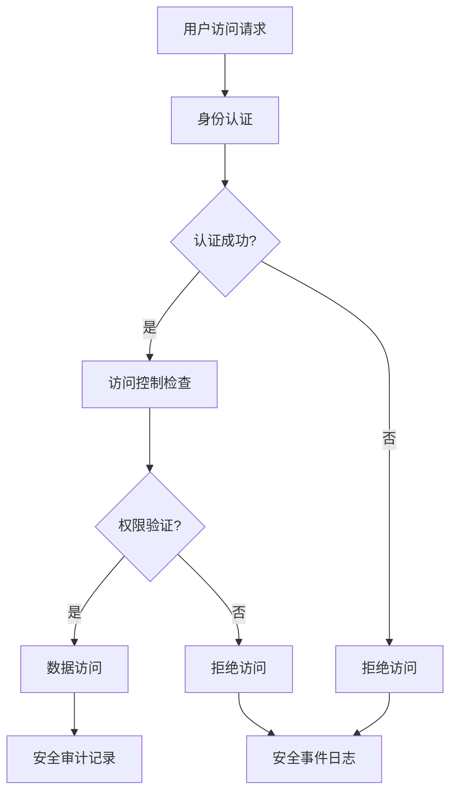

# 问题：系统安全设计
回答如下：
「系统安全设计」 请根据以下内容：
系统安全设计包括身份认证、访问控制、数据加密、安全审计和安全测试。采用OAuth2、JWT等认证机制，实现基于角色的访问控制（RBAC），对敏感数据进行加密存储，确保系统免受非法访问和攻击。
 细化回答: 
 要求：1. 回答要详细，内容丰富，实践与理论结合！2. 采用总分总的文章思路！3、适当进行图示说明# 系统安全设计详解

## 引言

在当今数字化时代，系统安全设计已成为保障信息系统稳定运行和数据安全的核心要素。随着网络攻击手段的不断升级和数据泄露事件的频发，构建一个全面、可靠的安全防护体系显得尤为重要。系统安全设计不仅关乎技术实现，更涉及安全管理、风险控制等多个维度，需要从身份认证、访问控制、数据加密、安全审计和安全测试等各个方面进行综合考虑。

## 系统安全设计的核心要素

### 1. 身份认证机制

身份认证是系统安全的第一道防线，其核心目标是验证用户身份的真实性。现代系统通常采用多因素认证（MFA）策略，结合密码、生物识别、硬件令牌等多种认证方式。

**OAuth2认证机制**：
- **授权码模式**：适用于Web应用，通过重定向获取授权码再换取访问令牌
- **隐式模式**：适用于移动应用，直接返回访问令牌
- **密码模式**：适用于信任的应用，用户直接提供凭据
- **客户端凭证模式**：适用于服务器间通信

**JWT（JSON Web Token）认证**：
```
Header.Payload.Signature
```
- Header：包含令牌类型和签名算法
- Payload：包含用户信息和声明
- Signature：用于验证令牌完整性

### 2. 访问控制体系

基于角色的访问控制（RBAC）是实现细粒度权限管理的核心机制。

**RBAC模型架构**：
```
用户 → 角色 → 权限
```

**典型权限层次结构**：
- **系统管理员**：拥有最高权限，可管理所有功能
- **普通用户**：仅能访问基本功能和数据
- **审计员**：具备查看日志和安全信息的权限
- **数据管理员**：负责特定数据集的管理

### 3. 数据加密保护

数据加密是保护敏感信息免受未授权访问的关键技术。

**加密层次**：
```
传输层加密（TLS/SSL）
应用层加密（AES-256）
存储层加密（数据库加密）
```

**加密算法选择**：
- **对称加密**：AES-256，适用于大量数据加密
- **非对称加密**：RSA-2048，用于密钥交换和数字签名
- **哈希算法**：SHA-256，用于数据完整性验证

### 4. 安全审计系统

安全审计是监控和记录系统活动的重要手段。

**审计内容**：
- 用户登录登出记录
- 关键操作日志
- 数据访问模式分析
- 异常行为检测

**审计机制**：
```
实时监控 → 日志记录 → 异常检测 → 报警通知
```

### 5. 安全测试流程

安全测试是验证系统安全防护能力的重要环节。

**测试类型**：
- **渗透测试**：模拟攻击者行为发现漏洞
- **代码审计**：静态分析代码安全性
- **漏洞扫描**：自动化检测已知漏洞
- **安全评估**：全面评估整体安全状况

## 实践应用示例

### 安全架构图示

```
┌─────────────────┐    ┌─────────────────┐    ┌─────────────────┐
│   用户接口层    │    │  应用服务层     │    │   数据存储层    │
│                 │    │                 │    │                 │
│  [浏览器]       │───▶│  [API网关]      │───▶│  [数据库]       │
│  [移动应用]     │    │  [认证服务]     │    │  [文件存储]     │
│                 │    │  [授权服务]     │    │                 │
└─────────────────┘    └─────────────────┘    └─────────────────┘
        │                       │                       │
        ▼                       ▼                       ▼
┌─────────────────┐    ┌─────────────────┐    ┌─────────────────┐
│  身份认证系统   │    │  访问控制模块   │    │  数据加密层     │
│                 │    │                 │    │                 │
│  OAuth2/JWT     │    │  RBAC模型       │    │  AES-256        │
│  多因素认证     │    │  权限检查       │    │  TLS/SSL        │
└─────────────────┘    └─────────────────┘    └─────────────────┘
```

### 安全防护流程



## 安全设计最佳实践

### 1. 分层防护策略
采用多层防御机制，确保即使某一层被突破，其他层仍能提供保护。

### 2. 最小权限原则
用户和系统组件只授予完成任务所需的最小权限。

### 3. 持续监控
建立实时监控体系，及时发现和响应安全威胁。

### 4. 定期评估
定期进行安全评估和渗透测试，持续改进安全防护能力。

## 总结

系统安全设计是一个复杂而系统的工程，需要从多个维度综合考虑。通过实施完善的认证机制、精细的访问控制、全面的数据加密、有效的安全审计和严格的测试流程，可以构建起坚固的安全防护体系。在实际应用中，应该根据具体的业务需求和技术环境，灵活选择和组合各种安全技术和措施，形成适合自身特点的安全防护方案。

随着技术的不断发展，系统安全设计也需要持续演进，引入新的安全理念和技术手段，如零信任架构、人工智能安全检测等，以应对日益复杂的网络安全威胁。只有这样，才能真正保障信息系统的安全稳定运行。[DONE]